# Using AI to Classify Malware into Families Using Static and Dynamic Features

**Final Report** · **Author:** thisisuly

**Word Count:** 10’856 (excluding contents pages, figures, tables, references and appendices)

> Converted from the submitted Word document. Personal details have been removed.

## Contents

- [List of Abbreviations](#list-of-abbreviations)
- [Abstract](#abstract)
- [1. Introduction](#1-introduction)
  - [1.1. Project Background](#11-project-background)
  - [1.2. Problem Statement and Research Gap](#12-problem-statement-and-research-gap)
  - [1.3. Project Aims and Objectives](#13-project-aims-and-objectives)
- [2. Literature and Technology Review](#2-literature-and-technology-review)
  - [2.1. Literature Review](#21-literature-review)
  - [2.2. Technology Review](#22-technology-review)
- [3. Methodology](#3-methodology)
  - [3.1. Overview of Experiment](#31-overview-of-experiment)
  - [3.2. Dataset Acquisition and Preparation](#32-dataset-acquisition-and-preparation)
  - [3.3. Feature Extraction](#33-feature-extraction)
  - [3.4. Data Preprocessing](#34-data-preprocessing)
  - [3.5. Model Architectures](#35-model-architectures)
  - [3.6. Training Strategy](#36-training-strategy)
  - [3.7. Evaluation and Explainability](#37-evaluation-and-explainability)
  - [3.8. Changes From Interim](#38-changes-from-interim)
- [4. Results](#4-results)
  - [4.1. BIG2015 Random Forest](#41-big2015-random-forest)
  - [4.2. CIC-MalMem-2022 Binary Detection](#42-cic-malmem-2022-binary-detection)
  - [4.3. CIC-MalMem-2022 Random Forest Family Classification](#43-cic-malmem-2022-random-forest-family-classification)
  - [4.4. CIC-MalMem-2022 Multi-layer Perceptron](#44-cic-malmem-2022-multi-layer-perceptron)
  - [4.5. Ensemble](#45-ensemble)
  - [4.6. Feature Importance](#46-feature-importance)
  - [4.6.3. Agreement Between Methods](#463-agreement-between-methods)
  - [4.7. Summary of Results](#47-summary-of-results)
- [5. Discussion](#5-discussion)
  - [5.1. Hypothesis Evaluation](#51-hypothesis-evaluation)
  - [5.2. Comparison with Prior Work](#52-comparison-with-prior-work)
  - [5.3. Feature Importance](#53-feature-importance)
  - [5.4. CNN to MLP Pivot](#54-cnn-to-mlp-pivot)
  - [5.5. Limitations](#55-limitations)
  - [5.6. Further Work](#56-further-work)
- [6. Conclusion](#6-conclusion)
- [7. Legal, Social, Ethical and Professional Issues](#7-legal-social-ethical-and-professional-issues)
  - [7.1. Legal](#71-legal)
  - [7.2. Social](#72-social)
  - [7.3. Ethical](#73-ethical)
  - [7.4. Professional](#74-professional)
  - [7.5. Sustainable Development Goals (SDG)](#75-sustainable-development-goals-sdg)
- [Appendix A: Confusion Matrices](#appendix-a-confusion-matrices)
  - [A.1 BIG2015 – Random Forest](#a1-big2015--random-forest)
  - [A.2 CIC-MalMem-2022 – RF Binary Detection](#a2-cic-malmem-2022--rf-binary-detection)
  - [A.3 CIC-MalMem-2022 – RF Family Classification](#a3-cic-malmem-2022--rf-family-classification)
  - [A.4 CIC-MalMem-2022 – MLP Binary Detection](#a4-cic-malmem-2022--mlp-binary-detection)
  - [A.5 CIC-MalMem-2022 – MLP Family Classification](#a5-cic-malmem-2022--mlp-family-classification)
  - [A.6 CIC-MalMem-2022 – Ensemble](#a6-cic-malmem-2022--ensemble)
- [Appendix B: Feature Importance Data](#appendix-b-feature-importance-data)
  - [B.1 BIG2015 – Gini Feature Importance (Top 20)](#b1-big2015--gini-feature-importance-top-20)
  - [B.2 BIG2015 – Permutation Importance (Top 20)](#b2-big2015--permutation-importance-top-20)
  - [B.3 CIC-MalMem-2022 – Gini Feature Importance](#b3-cic-malmem-2022--gini-feature-importance)
  - [B.4 CIC-MalMem-2022 – Permutation Importance (Family, Hybrid)](#b4-cic-malmem-2022--permutation-importance-family-hybrid)
- [Appendix C: Complete Scripts](#appendix-c-complete-scripts)
- [References](#references)

# List of Abbreviations

| Abbreviation | Full Terminology |
|:---|:---|
| AI | Artificial Intelligence |
| ML | Machine Learning |
| DL | Deep Learning |
| RF | Random Forest |
| MLP | Multi-layer Perceptron |
| CNN | Convolutional Neural Network |
| RNN | Recurrent Neural Network |
| GNN | Graph Neural Network |
| GINE | Graph Isomorphism Network Enhanced |
| GAT | Graph Attention Network |
| GN-BiLSTM | Graph Network Bidirectional Long Short-Term Memory |
| SVM | Support Vector Machine |
| SHAP | SHapley Additive exPlanations |
| SMOTE | Synthetic Minority Over Sampling Technique |
| ADASYN | Adaptive Synthetic Sampling |
| ReLU | Rectified Linear Unit |
| CIC-MalMem-2022 | Canadian Institute for Cybersecurity Malware Memory 2022 |
| BIG2015 | Microsoft Malware Classification Challenge (Kaggle, 2015) |
| MIGAN | Malware Image GAN |
| MCTVD | Malware Classification based on Three-channel Visualisation and Deep Learning |

# Abstract

The increasing complexity of malware has made traditional signature-based detection approaches insufficient, particularly for identifying previously unseen variants. Most prior work on malware detection focuses on binary classification rather than the more challenging task of family-level classification. This study investigates the effectiveness of machine learning and simple deep learning methods for multi-class malware classification using both static and dynamic features.

Two datasets were evaluated: Microsoft Malware Classification Challenge (BIG2015) for static analysis and CIC-MalMem-2022 for memory-based dynamic analysis. A Random Forest (RF) classifier and a Multi-layer Perceptron (MLP) were implemented, alongside ensemble methods which included averaging and logistic regression stacking. Performance was assessed using a macro F1-score to account for class imbalance.

The results demonstrate that opcode-based static features achieve results which were consistent with prior work on BIG2015 (macro F1 = 0.9907). On CIC-MalMem-2022, the hybrid feature combinations provided the best performance for family classification (macro F1 = 0.55), while binary detection was effectively saturated across all the models with a macro F1 of 1.0 for dynamic and hybrid features. The RF consistently outperformed the MLP with a macro F1 margin of 0.1829, while the ensemble methods did not improve on the RF’s performance.

The findings show that tree-based models are still highly effective on tabular malware data, with RF matching or exceeding dedicated deep learning architectures on family-level classification (76.04% vs 74.65% on GN-BiLSTM), highlighting the importance of feature representation over model complexity.

# 1. Introduction

## 1.1. Project Background

Malware continues to be an expensive and persistent threat due to its increasing sophistication and evasion \[1\]-\[3\]. Common malware families include Trojans, Backdoors, Worms, Ransomware and others. Emotet, TrickBot, Zeus and WannaCry have demonstrated polymorphism, code packing and environmental awareness techniques that allow them to bypass signature-based and heuristic detection tools \[4\], \[5\]. These techniques allow malware to change its structure or behaviour dynamically while still maintaining its functionality and rendering signature-based systems inadequate \[1\], \[2\], \[5\].

WannaCry exploited the SMB vulnerability in Windows systems showing the widespread impact of zero-day threats when unknown vulnerabilities are exploited and subsequently spread quickly without any existing signatures to allow for their detection \[4\]. These developments have highlighted the limits of reactive detection and motivated adoption of AI-based solutions. Traditional tools reliant on predefined signatures and rule-based detection struggle with the evolution and mutation of malware families \[1\], \[6\]. This motivates the development of machine learning approaches that can generalise beyond known signatures \[1\], \[5\].

However, a critical distinction exists in the gap between malware detection and malware family classification \[2\], \[7\]. While detection determine whether a sample is malicious or benign, family classification assigns the malware to a specific category which enables deeper behavioural and forensic insight \[7\], \[8\]. This is in turn inherently more difficult to accomplish due to the increased class complexities and the overlapping behavioural patterns \[7\], \[8\].

## 1.2. Problem Statement and Research Gap

Despite advances in ML and DL approaches several challenges remain in malware family classification. The existing studies often prioritise binary detection tasks, with a limited focus on fine tuned family classification \[1\], \[7\], \[9\]. Although datasets such as CIC-MalMem include multiple malware families, many of the studies simplify the task to binary classification or provide limited analysis of class-specific performance \[1\], \[7\], \[9\].

Furthermore, while hybrid ML-DL approaches have been proposed these are typically evaluated on binary tasks or specific feature modalities \[7\], \[10\], \[11\]. This creates a gap in understanding whether hybrid approaches improve performance in multi-class family classification settings.

Work by Grinsztajn et al. and Shwartz-Ziv and Armon shows that DL models don’t consistently outperform classical approaches on tabular data, which raises the question of whether simpler models like a RF can match or exceed deep learning approaches for multi-class malware classification on tabular features \[12\], \[13\].

This motivates the following problem: To evaluate a machine learning and ensemble approach for malware family classification using static and dynamic features to assess whether the combination can improve performance, classification performance over stand-alone models.

## 1.3. Project Aims and Objectives

Aim: Evaluate a model combining RF and MLP for classifying malware into families using static and dynamic features, targeting improved performance over stand-alone models.

Objectives:

- Do a comprehensive literature review of existing research on AI-based malware detection and classification while focusing on ML, DL and hybrid approaches that utilise static and dynamic feature set for malware analysis.

- Identify and select suitable datasets from publicly available sources e.g. CIC-MalMem-2022 and Microsoft Malware Classification Challenge (BIG 2015).

- Preprocess and standardise the selected datasets: ensure consistent feature representation, class distribution and data balance before model training and validation.

- Evaluate baseline models on the acquired datasets and implement an ensemble model that can integrate the learned representations and decision output from both the RF and MLP models.

- Assess and compare the performance of individual and hybrid models using established evaluation metrics such as accuracy and macro F1 score while applying cross-validation to ensure reliability

- Apply explainable AI (XAI) methods to identify what features contributed the most to malware family classification and improve model interpretability.

- Lastly, present the findings and recommendations so that it can be used for future malware detection systems and digital forensic workflows.

### 1.4. Research Question

Main research question: Is malware family classification more effective using individual models on static and dynamic features or a hybrid approach?

Supporting questions:

- Which feature types (static, dynamic and hybrid) are most effective for malware family classification?

- How does the performance of RF compare to MLP on tabular malware data?

- Does combining RF and MLP improve classification performance over individual models?

### 1.5. Hypotheses

Hypothesis one: The combined use of static and dynamic features will result in a higher macro F1 score than either feature set when used for malware family classification.

Hypothesis two: The RF is expected to have achieved a higher macro F1 score than the MLP when applied to CIC-MalMem-2022.

Hypothesis three: Using an ensemble of RF and MLP will produce a higher macro F1 score than the best performing stand alone model.

### 1.6. Report Structure

The following report is structured like the following: Chapter 2 reviews the literature on malware detection and ML approaches. Chapter 3 discusses the methodology including dataset selection, preprocessing and model implementation. Chapter 4 presents the results of the experiment. The results are discussed in Chapter 5 in the context of the research question and hypotheses. Chapter 6 provides the conclusion to the report and identifies areas for future work. Lastly, Chapter 7 addresses legal, social, ethical and professional issues.

# 2. Literature and Technology Review

## 2.1. Literature Review

This chapter reviews the existing literature on malware classification through the use of Machine Learning and Deep Learning. It looks to identify the research gaps around family level classification on tabular features and asses the technology chosen for the project including datasets, models, evaluation metrics and the tools implemented, to then link them to the research question.

### 2.1.1 Evolution of Malware Detection Techniques

Malware is still a persistent challenge as attackers employ polymorphism, packing and environmental awareness to circumvent conventional signature based and heuristic detection systems \[1\], \[2\]. Accordingly, research increasingly applies ML/DL to learn patterns automatically \[1\], \[5\], \[8\], \[14\], \[15\].

The first ML-based malware classifiers such as Support Vector Machines (SVMs), Decision Trees (DTs) and Random Forests (RFs), used static features extracted from executables such as PE headers, byte n-grams and imported function calls \[5\], \[16\], \[17\]. Of them, RF emerged as the most widely adopted for malware classification due to its resistance to over fitting through bagging and its capacity to handle high-dimensional feature vectors \[16\], \[18\].

While methods such as XGBoost and LightGBM show competitive results on tabular tasks, a RF was chosen for the project due to its simplicity and interpretability through feature importance scores and it’s already established use across malware classification benchmarks \[12\], \[18\]. While the aforementioned methods showed a reasonable measure of accuracy, they were limited when it came to classifying unseen or obfuscated malware due to the lack of behavioural visibility and inability to capture runtime behaviours \[2\], \[7\], \[8\].

To address this, dynamic analysis was integrated into the learning pipelines. Dynamic features like API call sequences, argument values, and registry manipulations allowed for a more comprehensive understanding of malware behaviour \[16\], \[19\]. Dynamic approaches, however, require sandboxed environments which can in-turn create higher computational overheads \[8\], \[19\].

On top of this, feature representation plays a critical role in malware classification performance \[12\], \[16\]. Static datasets such as BIG2015 rely on engineered representations including byte histograms and opcode frequency distributions, while dynamic datasets such as CIC-MalMem-2022 are derived from memory forensic tools \[21\]-\[23\]. Most published studies on CIC-MalMem-2022 focus on binary detection with limited work done to address multi-class family classification \[23\], \[24\]. This highlights a research gap in evaluating the effectiveness of feature combinations for more complex classification tasks.

Therefore, this highlights a gap in the current research showing the need to evaluate whether combining static and dynamic features can improve the performance of family-level malware classification.

### 2.1.2. Deep Learning for Malware Analysis

DL models such as CNNs, RNNs and Graph Neural Networks (GNNs) excel at automatically learning high-level feature representations in comparison to their machine learning counterparts \[8\], \[25\], \[26\], \[27\]. For example, Anand et al. discuss the use of CNN architectures for classifying malware binaries that have been converted into grayscale or RGB images allowing for the use of visual patterns to classify them into malware families \[28\].

The model Malware Classification based on Three-channel Visualisation and Deep learning (MCTVD) achieves accuracy by turning assembly instruction sequences into a three-channel image for CNN classification, exploiting intra-family texture similarity. It reported an accuracy of 99.44% using a ten-fold cross-validation on the BIG2015 dataset \[11\] . However, the dataset is from 2015 and contains malware families that might not represent modern threats, which raises the question of the real-world utility of these results.

Dynamic analysis has benefited significantly from the advances in deep learning. GNNs such as DMalNet use Graph Isomorphism Network Enhanced (GINE) and Graph Attention Network (GAT) to detect and classify malware \[32\]. The model uses an API call graph to turn the relationship between API calls into the structural information of the graph which after analysing over twenty thousand benign and eighteen thousand malicious samples was able to achieve an accuracy of 98.43% in detecting malware and 91.42% in classifying them into families \[32\]. While the results are strong, the classification accuracy of 91.42% shows that family-level classification is still harder than binary detection, a pattern which is consistent across the literature \[23\], \[24\]. DL models have been applied to other security classification tasks such as malicious URL detection which demonstrates the breadth of application that deep learning can exhibit in cybersecurity \[35\].

Dynamic analysis has been applied in IoT contexts using CN-based approaches \[34\]. Similar approaches use deep feature extraction from malware visualisations show strong results \[29\], \[30\]. Ensemble CNN approaches for malware image classification has also demonstrated strong performances \[31\]. Directed API call graph approaches also show strong classification results \[32\], \[33\].

CNNs and GNNs extract strong image/graph representations but are weak on explainability and efficiency \[11\], \[32\]. However, work by Grinsztajn et al. and Shwartz-Ziv and Armon demonstrates that DL models don’t consistently outperform tree-based methods on tabular data \[12\], \[13\]. This is shown through three key mechanisms:

1.  Neural networks aren’t robust to noisy features which are common in tabular data types \[12\].

2.  Neural networks fail to preserve feature orientation causing them to struggle when trying to exploit structured feature relationships \[12\].

3.  Neural networks tend to over smooth learned functions, reducing their ability to capture sharp decision boundaries required for classification tasks \[12\].

This is important for datasets such as CIC-MalMem-2022 where features are structured and tabular rather than spatial or sequential. Models such as Convolutional Neural Networks (CNNs) which rely on spacial locality, are as such less suitable for these types of data representations \[12\], \[29\]. This limitation motivated the use of an MLP, which is a simpler DL architecture that doesn’t impose spatial assumptions and as such better aligned with tabular feature inputs \[12\], \[13\]. This choice allows for a fair comparison with more classical machine learning models such as RF. This highlights how model performance is highly dependent on the representation of features not just the complexity of the model alone.

### 2.1.3. Hybrid Model Approaches

Many studies appear to emphasise the importance of integrating multi-view feature fusion as a means of exploiting complementary insights from static and dynamic perspectives \[36\], \[37\]. Chaganti et al prove that integrating a multi-view CNN with PE import tables, API call traces and binary images achieved 97% accuracy when classifying malware as malicious or benign files. However, this was limited to binary classification rather than the more challenging task of family-level classification \[36\].

With comparative analysis it has shown that combining models has led to measurable improvements in F1-score and recall across malware families, showing the need for hybrid architectures \[8\], \[10\], \[36\], \[39\]. However, these improvements are often reported on binary classification and may not apply to multi-class family classification tasks. Further research shows that the combination of outputs and decisions of multiple models is better than combining their features before classification due to the strengths of each model is preserved when the outputs are combined \[25\], \[36\], \[38\].

Despite the widespread use of hybrid approaches the evidence suggests that fusion doesn’t always lead to improved performance. Studies show that ensemble methods provide gains when the individual models show sufficient diversity in their error patterns \[40\]. Kuncheva argues that when models produce highly correlated predictions, combining them will offer limited or no benefit \[40\]. Similar findings show that fusion improves performance in only a minority of cases, especially when applied to complex classification tasks \[40\].

This raises a question of whether ensemble methods will provide meaningful improvements when the constituent models show similar behaviours, this being relevant to this project where the RF and MLP work on the same tabular feature space.

Evidence from the literature supports the decision to employ a late-fusion strategy where the independently trained models can contribute their prediction probabilities to come to a combined decision \[10\], \[36\], \[38\]. The project employs a similar approach by combining RF and MLP outputs through averaging and logistic regression stacking to produce the final family classification.

### 2.1.4. Data Imbalance, Augmentation and Interpretability

Class imbalance is still an important issue when it comes to malware family classification due to the uneven representation of malicious categories, the imbalance can bias the models towards majority classes reducing their ability to accurately detect under represented malware families \[7\], \[9\]. Generative models such as Malware Image GAN (MIGAN) are used to make class-specific malware images, which has helped improve classification accuracy up to 99.5% by augmenting families that are under represented \[41\].

Additionally, being able to interpret the models has become an increasingly important \[42\]. Traditional ML models like RF have remained valuable as a way of understanding feature importance as they offer transparency in contrast to DL models’ and their black-box nature \[43\].

The project aims to address class imbalance using two approaches: a balanced class weight for the RF models and SMOTE for the MLP and ensemble. This dataset-specific shows the differences in the model requirements, the RF supports class weighting natively while the MLP benefits from resampling the training data.

While alternatives such as ADASYN and cost-sensitive learning exist, the selection of SMOTE was chosen due to its simplicity and widespread adoption in malware classification studies \[44\]. Interpretability is assessed through Gini importance and permutation importance on the RF model, providing insight into which features contribute most to family-level classification.

## 2.2. Technology Review

### 2.2.1. Model Design and Architecture

The project implements three models: a RF, an MLP and two ensemble fusions (simple averaging and logistic regression stacking). The RF is applied to both the BIG2015 and CIC-MalMem-2022 datasets while the MLP is trained on CIC-MalMem-2022 only.

The RF was configured with 400 trees for both datasets with a max_depth of 25 for CIC-MalMem-2022. RF’s were chosen due to their capacity to handle high-dimensional vectors their resistance to overfitting through bagging and their interpretable feature importance scores \[12\], \[18\].

This decision is supported by studies that demonstrated that tree-based models consistently outperformed deep learning approaches on tabular datasets, which reinforces the suitability of the RF for the task \[12\], \[13\].

An MLP was selected as the DL component as discussed in section 2.1.2, CNN’s aren’t well suited to tabular data making the simpler feedforward architecture more appropriate for the structured features in CIC-MalMem-2022 \[12\], \[13\].

### 2.2.2. Datasets and Processing

Choosing an appropriate dataset is important to ensuring the reliability and validity of the proposed experiment. The study uses two widely recognised benchmark datasets: the Microsoft Malware Classification Challenge (BIG2015) and the CIC-MalMem-2022 datasets. These were chosen due to them representing static and dynamic malware characteristics respectively, which allows for a comprehensive evaluation of feature effectiveness for malware family classification \[21\], \[22\].

##### BIG2015 Dataset

BIG2015 contains 10’868 labelled malware samples across nine distinct families the dataset was originally released as a Kaggle competition with separate training and test sets, however, truth labels for the test set were never publicly released, as such all the experiments were conducted on the labelled training set, split into a 70/15/15 split for training, validation and testing. Each sample includes raw bytecode and disassembled opcode frequency distributions \[21\].

These features are especially suited for tree-based models such as RF as they produce tabular representations that can be effectively handled without requiring feature scaling or transformation \[18\]. Prior work has demonstrated near ceiling performance on the dataset using engineered features, which reinforces its suitability as a benchmark for static malware classification \[11\], \[21\].

##### CIC-MalMem-2022

CIC-MalMem-2022 contains memory forensic features extracted using Volatility plug-ins which captured runtime behaviours such as: process activity, memory allocation and API usage patterns \[22\]. The dataset has 58’596 samples across 16 classes (15 malware families and 1 benign class) which supports both binary and multi-class classification tasks.

Existing studies on this dataset typically focus on binary classification of malware and benign with limited work addressing family level classification which establishes a clear research gap that this study aims to address \[23\], \[24\], \[45\].

##### Preprocessing and Data Handling

All preprocessing steps were applied consistently across models to ensure a fair comparison. The datasets were split in three, 70% for training, 15% for validation and a final 15% for testing. This was done as a means of preserving class distributions.

Feature scaling was applied using Min-Max normalisation, fitted exclusively on the training data to prevent any data leakage. Class imbalance was addressed differently across each of the experiments. For the RF models, balanced class weights were used and they adjusted the weight of each class inversely to their frequency. For the MLP and ensemble, the Synthetic Minority Over Sampling Technique (SMOTE) was used on the training sets, which generated synthetic samples for minority classes and is a widely adopted technique in malware classification tasks \[44\].

##### Feature Integration

For BIG2015 three feature modes were evaluated:

- Byte histograms

- Opcode frequency

- A combination of them both.

For CIC-MalMem-2022, three feature modes were evaluated:

- Static features

- Dynamic features

- A combination of them both.

The RF was trained on both of the datasets while the MLP was trained on CIC-MalMem-2022 only, providing the opportunity for a direct comparison between the MLP and RF on family level classification. Each model was evaluated across each of the feature modes to assess how the different feature types affected performance. For the ensemble, the RF and MLP each produced a probability vector for every test sample which was then combined using simple averaging and logistic regression stacking.

### 2.2.3. Evaluation and Performance Metrics

The performance of the models were evaluated using classification metrics that ensured a comprehensive assessment.

Using accuracy measures the overall proportion of correctly classified samples, but that can be misleading if there is class imbalance \[46\]. Lastly, F1 Score represents the mean between precision and recall and is useful when evaluating imbalanced datasets \[46\].

The primary metric of evaluation chosen was the Macro F1-Score as it provides equal weight to all the classes regardless of how frequent they appear, which is especially important for malware due to minority classes potentially being the most critical of threats \[46\].

Doing this ensures that model performance is evaluated consistently across all malware families rather than just being biased against the most frequently appearing classes, making it more suitable than accuracy for imbalanced multi class classification problems \[46\].

Model validation was performed using a five-fold cross validation on the training data to ensure robustness while still maintaining computational efficiency.

Model performance was further analysed using confusion matrices and per-class F1 comparisons which give insight into class specific performance and misclassification patterns.

### 2.2.4. Implementation Technologies

All experiments were conducted on Spyder within Anaconda, using established machine learning and data processing libraries \[47\].

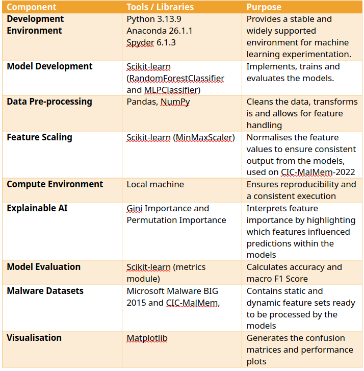

All datasets used are open-source and ethically compliant which requires no handling of live malware samples. Each experiment was conducted in a controlled local environment using Anaconda and Spyder. Live malware was not used so no malware execution was implemented as pre-extracted malware was used. This ensured compliance with university cybersecurity policies.

### 2.2.5. Rationale and Link to Research Objectives

The combined use of BIG2015 and CIC-MalMem-2022 enables a direct comparison between static and dynamic feature representations for malware classification. This supports hypothesis one, which predicts combining static and dynamic features will improve family classification performance.

Having both an RF and MLP enabled the evaluation of Hypothesis 2 which predicted that the RF will outperform the MLP on tabular malware features.

Finally, the use of ensemble methods supports the last Hypothesis which predicted the ensemble fusion would improve over the best stand-alone model.

Together, the choices ensure that the hypotheses are directly testable within a controlled framework, allowing for systematic evaluation of feature representations, model performance and ensemble effectiveness.

# 3. Methodology

This chapter provides the experiment’s results across all the datasets and models. A summary table consolidates the key findings at the end of the chapter.

## 3.1. Overview of Experiment

The study uses a structured approach to evaluate how effective machine learning and deep learning is for malware family classification. The methodology is designed to ensure a fair and controlled comparison between models, feature representations and ensemble strategies. While MLPs are sometimes considered a foundational deep learning architecture, this model, a shallow feed-forward neural network with three hidden layers was chosen because of its alignment with the tabular nature of the input data without imposing any spatial assumptions required by more complex architectures such as CNNs \[12\], \[13\].

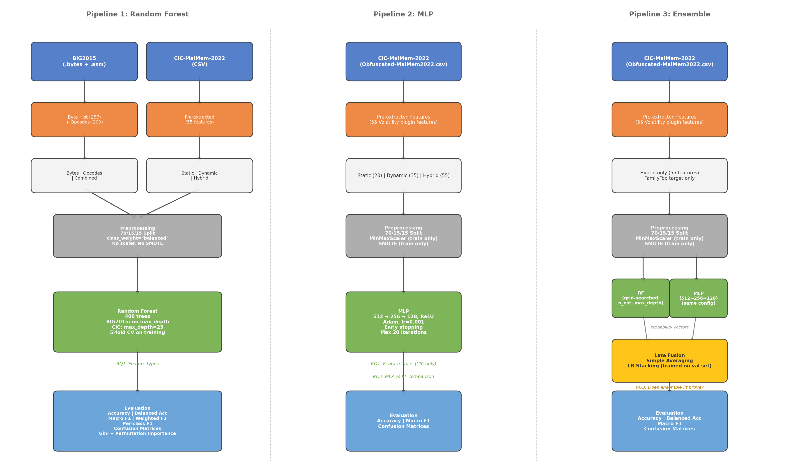

*Figure 1: Pipeline overview showing the flow of data from dataset acquisition, feature extraction, preprocessing, model training and evaluation*

##### Feature Extraction and Preparation

Static features were extracted from the BIG2015 dataset to produce byte histograms and opcode frequency vectors, while dynamic features were pre-extracted from the CIC-MalMem-2022 dataset preventing the need for running a sandbox. Both feature sets were then pre-processed to ensure consistency across the models.

##### Model Training and Evaluation

Two models were used, a RF and an MLP. The RF was applied to both datasets, while the MLP was evaluated on CIC-MalMem-2022 due to its suitability for tabular features. The MLP wasn’t used on the BIG2015 dataset as it was instead used to serve as the benchmark for feature comparison, the RF was used exclusively to achieve this without introducing an additional variable such as architecture. CIC-MalMem-2022 provided the data to allow for a controlled comparison needed to evaluate the proposed second hypothesis.

##### Ensemble Learning

The outputs of the RF and MLP were combined using late fusion techniques, which included simple averaging and logistic regression stacking. This assessed whether the combination of outputs improved classification performance. Late fusion was chosen over early fusion to preserve the independent learning behaviours of each model while avoiding the introduction of noise. The RF and MLP were trained independently in parallel on the same data split with neither model’s output being used as input for the other during training.

To ensure the evaluations were robust, all the models were trained using stratified data splits, for both BIG2015 and CIC-MalMem-2022 a 5-fold stratified cross validation was applied on the training portion to estimate generalisation performance before the held-out test set was used. The ensemble, however uses the validation set to train the logistic regression stacking classifier. Performance was assessed through macro F1 as the main metric allowing for fair comparisons across the imbalance malware families.

Each component was explicitly designed to test the hypotheses. This design allows for a controlled isolation of three main factors: feature representation, model selection and ensemble fusion. This lets each of the hypotheses be evaluated independently within a consistent framework.

## 3.2. Dataset Acquisition and Preparation

Two benchmark datasets were used to represent static and dynamic characteristics: BIG2015 and CIC-MalMem-2022 datasets.

### 3.2.1. BIG2015

The BIG2015 dataset contains 10’868 labelled malware samples across nine families each of which contains raw bytecode and disassembled assembly files. This dataset was originally released as a Kaggle competition with separate training and test sets. Unfortunately, ground-truth labels for the test set were never publicly released so all the experiments used the labelled training set which was split internally into a training (70%), validation (15%) and testing (15 %) sets.

The data was used to extract static features including byte histograms and opcode frequency distributions and three feature modes were evaluated: bytes only, opcodes only and a combination of both features.

### 3.2.2. CIC-MalMem-2022

CIC-MalMem-2022 contains 58’596 samples across 16 classes, 15 malware families and 1 benign class. It contains pre-extracted features which were derived from memory forensic analysis using Volatility plug-ins. The dataset was evaluated based on 55 features split into three modes: Static, dynamic and a hybrid of both. The static feature mode contained: pslist, dlllist and handles totalling to 20 features. Dynamic contained: ldrmodules, malfind, psxview, svcscan, callbacks and modules totalling 35 features and lastly hybrid combined all 55.

## 3.3. Feature Extraction

For BIG2015 features were extracted directly from the raw sample files. Each .bytes file was processed into a 257-bin histogram counting the frequency of each byte (0x00 to 0xFF) with an additional bin for used for unknown or unreadable bytes (??). Each .asm file was broken down to count the occurrences of the top 200 most frequent opcodes per sample (e.g. mov, push, call). These were evaluated independently and together, this produced roughly 6’489 features per sample when combined. Furthermore the extracted features were cached to avoid re-computation across the experiments.

**Code Snippet 1a: Byte Histogram Extraction**

```python
def byte_histogram(bytes_file_path):
    byte_counts = {}
    for i in range(256):
        byte_counts["b_" + str(i)] = 0
    byte_counts["b_unk"] = 0
    bytes_file = open(bytes_file_path, "r", errors="ignore")
    for line in bytes_file:
        tokens = line.strip().split()
        if len(tokens) <= 1:
            continue
        for hex_token in tokens[1:]:
            if hex_token == "??":
                byte_counts["b_unk"] += 1
            else:
                try:
                    byte_value = int(hex_token, 16)
                    if 0 <= byte_value <= 255:
                        byte_counts["b_" + str(byte_value)] += 1
                except ValueError:
                    pass
    bytes_file.close()
    return byte_counts
```

*Byte histogram extraction from raw .bytes files. Each hex token is parsed and counted, producing 257 features per sample.*

**Code Snippet 1b: Opcode Frequency Extraction**

```python
def opcode_counts(asm_file_path, topk=200):
    opcode_counter = Counter()
    asm_file = open(asm_file_path, "r", errors="ignore")
    for line in asm_file:
        parts = line.strip().split()
        if len(parts) < 2:
            continue
        if ":" in parts[0]:
            candidate = parts[1].lower()
            if candidate.isalpha():
                opcode_counter[candidate] += 1
    asm_file.close()
    top_opcodes = opcode_counter.most_common(topk)
    return {"op_" + op: count for op, count in top_opcodes}
```

*Opcode frequency extraction from .asm files. The top 200 most frequent opcodes are retained as features.*

For CIC-MalMem-2022 no feature extraction was necessary due to the dataset providing pre-computed numeric features which were derived from Volatility’s memory forensic plugins.

These features capture behavioural characteristics of malware at runtime which enables a direct comparison between static and dynamic representations.

## 3.4. Data Preprocessing

Before training the dataset was preprocessed for consistency and the prevention of data leakage. The partition was arranged as 70% for training, 15% for validation and 15% for testing with stratified sampling to preserve class distributions.

For CIC-MalMem-2022, feature scaling was applied using Min-Max normalisation, this was fitted exclusively on the training data and applied to validation and test sets. This is to ensure that no information from the unseen data can influence the training process. Min-Max scaling was chosen for its suitability in neural network training where bounded input ranges can improve stability and prevent features with larger magnitudes from dominating the learning process. The BIG2015 RF models didn’t require feature scaling as RFs are invariant to feature magnitude

**Code Snippet 2a: MinMaxScaler (Training Data Only)**

```python
scaler = MinMaxScaler()
train_features = scaler.fit_transform(train_features)
validation_features = scaler.transform(validation_features)
test_features = scaler.transform(test_features)
```

*MinMaxScaler fitted on training data only. Validation and test sets use training statistics to prevent leakage.*

Class imbalance was handled across each dataset differently. For BIG2015, the RF was configured using balanced class weights which adjusts the weight of each class inversely to its frequency in the training data. For CIC-MalMem-2022, Synthetic Minority Oversampling Technique (SMOTE) was used for the training set generating synthetic samples for the minority classes to improve model performance on under-represented families while maintaining evaluation integrity.

SMOTE was chosen over basic oversampling techniques due to its ability to generate synthetic examples rather than duplicating existing examples, which is shown to improve generalisation in imbalanced classification tasks \[44\].

**Code Snippet 2b: SMOTE (Training Data Only)**

```python
smote = SMOTE(random_state=SEED)
train_features, train_labels = smote.fit_resample(
    train_features, train_labels
)
```

*SMOTE generates synthetic minority-class samples within the training set only. Validation and test sets remain unmodified.*

The dataset specific imbalance handling reflects differences in class distribution and feature structure to ensure that each model is configured in the best manner for its respective data characteristics.

Preprocessing steps were applied exclusively to the training data before being propagated to validation and test sets to make sure of strict separation of the data and preventing leakage throughout the experimental pipeline.

## 3.5. Model Architectures

### 3.5.1. Random Forest

The RF classifier was selected as the primary machine learning model due to its strong performance on high-dimensional tabular data and its robustness to over-fitting. The RF works as an ensemble of decision trees trained using bootstrap aggregation (bagging), where each of the trees is trained on a random subset of the data and their features which reduces variance and improving generalisation.

RFs are well suited to malware classification tasks involving engineered features such as byte histograms and opcode frequency distributions as it can effectively model non-linear interactions without needing feature scaling \[12\].

On top of that, RF provides interpretability through feature importance measures which aligns with the objective of incorporating explainable AI techniques.

##### Random Forest Configuration

| Parameter | Value | Justification |
|:---|:---|:---|
| Number of Trees (n_estimators) | 400 | Provides model diversity while ensuring computational efficiency |
| Maximum Depth (max_depth) | None (BIG2015), 25 (CIC-MalMem-2022) | Unconstrained depth for BIG2015 allows full tree growth. Depth limit on CIC-MalMem-2022 stops over-fitting on the structured tabular data while preserving model capacity |
| Class Weights (class_weight) | Balanced | Addresses class imbalance by weighting the minority classes more heavily |
| Random State | 14 | Ensures the results can be reproduced |

##### Application Across Datasets

| Dataset | Usage |
|:---|:---|
| BIG2015 | Primary model for evaluating static feature representations |
| CIC-MalMem-2022 | Baseline model for comparison against the MLP and Ensemble methods |

The consistent use of the RF over the datasets allows for a controlled comparison of the feature effectiveness without introducing more architectural variables.

### 3.5.2. Multi-layer Perceptron

The MLP was selected for the neural network component for the study to provide basic deep learning model as a baseline to provide a comparison for the tabular malware comparison. This allows for an evaluation on whether deep learning techniques provide any advantages over classical models on tabular malware data.

Unlike convolutional or sequential architectures, the MLP doesn’t assume spatial or temporal relationships between the features making it more appropriate for structured tabular data such as CIC-MalMem-2022 \[12\], \[13\].

##### MLP Architecture Design

The MLP was implemented using sklearn’s MLPClassifier as a shallow feed-forward architecture with three hidden layers.

**Code Snippet 3: MLP Model Definition**

```python
mlp_model = MLPClassifier(
    hidden_layer_sizes=(512, 256, 128),
    activation="relu",
    max_iter=20,
    learning_rate_init=0.001,
    early_stopping=True,
    validation_fraction=0.15,
    random_state=SEED,
)
mlp_model.fit(train_features, train_labels)
```

*sklearn MLPClassifier with three hidden layers progressively narrowing from 512 to 128 neurons.*

| Component | Configuration | Purpose |
|:---|:---|:---|
| Input Layer | Varies by feature mode (20, 35 or 55 features) | Matches the CIC-MalMem-2022 feature space |
| Hidden Layer 1 | 512 neurons, ReLU | Captures the initial feature interactions |
| Hidden Layer 2 | 256 neurons, ReLU | Learns the higher-level abstractions |
| Hidden Layer 3 | 128 neurons, ReLU | Refines the feature representations |
| Output Layer | 16 classes | Produces the class probability distributions |

##### Training Configuration

| Parameter | Value | Justification |
|:---|:---|:---|
| Implementation | Sklearn MLPClassification | Standard library implementation that’s suitable for tabular data |
| Optimiser | Adam (Learning rate = 0.001) | Efficient gradient-based optimisation |
| Activation Function | ReLU | Prevents any vanishing gradient issues |
| Max Iterations | 20 with early stopping | Stops over-fitting while letting convergence occur |
| Validation Fraction | 0.15 | Used for early stopping criterion |

The architecture was kept intentionally shallow to show the limitations of neural networks on tabular data and to ensure the comparison with the RF model is kept fair. The MLP doesn’t include any advanced regularisations or dropout as early stopping is used as the primary mechanism to prevent over-fitting.

##### Dataset Usage

<table style="width:97%;">
<colgroup>
<col style="width: 30%" />
<col style="width: 67%" />
</colgroup>
<tbody>
<tr>
<td style="text-align: left;"><strong>Dataset</strong></td>
<td style="text-align: left;"><strong>Usage</strong></td>
</tr>
<tr>
<td style="text-align: left;">BIG2015</td>
<td style="text-align: left;">Not Applied</td>
</tr>
<tr>
<td style="text-align: left;">CIC-Malmem-2022</td>
<td style="text-align: left;"><p><strong>Stand-alone</strong>: uses all 3 feature modes and targets 2, family and binary.</p>
<p><strong>Ensemble:</strong> Does family classification on the hybrid features</p></td>
</tr>
</tbody>
</table>

The MLP wasn’t applied to the BIG2015 dataset to avoid the introduction of architectural variability when evaluating the feature representations which ensured that any comparisons on the dataset remained focused entirely on the feature effectiveness.

### 3.5.3. Ensemble

To evaluate whether combining model outputs can improve classification performance two ensemble strategies were used: simple averaging and logistic regression stacking.

##### Late Fusion Strategy

The ensemble uses late fusion where individual models are each trained independently in parallel on the same 70% training split with SMOTE applied with their prediction probabilities combined at the decision level. Neither model’s output is used as input for the other during training.

The ensemble RF was configured to use grid search over the following space to select optimal hyper-parameters:

| Parameter | Values Tested |
|:--------------|:------------------|
| n_estimators  | 100, 200, 400     |
| max_depth     | None, 20          |

The best configuration was chosen based on the 5-fold cross-validated macro F1 on the SMOTE’d training data

##### Ensemble Methods

**Code Snippet 4: Ensemble Fusion Methods**

```python
# Fusion 1: Simple averaging
avg_proba = (rf_test_proba + mlp_test_proba) / 2
avg_preds = np.argmax(avg_proba, axis=1)

# Fusion 2: Logistic regression stacking
stack_val = np.hstack([rf_val_proba, mlp_val_proba])
stack_test = np.hstack([rf_test_proba, mlp_test_proba])

stacking_model = LogisticRegression(
    random_state=SEED, max_iter=1000,
    multi_class="multinomial",
)
stacking_model.fit(stack_val, val_labels)
stack_preds = stacking_model.predict(stack_test)
```

*Averaging combines probability vectors directly, stacking trains a logistic regression meta-learner on concatenated base model probabilities from the validation set.*

| Method | Description | Purpose |
|:---|:---|:---|
| Simple Averaging | The mean of the RF and MLP probability outputs | Baseline approach for fusion |
| Logistic Regression Stacking | Meta-classifier trained on the validation set’s predictions (max_iter=1000) | Learns the optimal combination of the model outputs |

##### Stacking Process

| Stage | Description |
|:---|:---|
| Base Models | RF and MLP that are trained independently but on the same SMOTE’d training split |
| Validation Predictions | RF and the MLP probability vectors are concatenated as input features for the meta-classifier |
| Meta-classifier | Logistic Regression |
| Final Output | Combination of probability predictions |

Using the validation set for training the stacking classifier makes sure that no information from the test is used during model combination, preventing data leakage and maintaining evaluation integrity.

The validation set was used instead of the training set because the base models would make overconfident predictions on the data that they were trained on.

##### Design Justification

Using averaging gives a simple baseline for evaluating whether the model combination is beneficial. Logistic regression stacking lets the model learnt the optimal weights for combining predictions. Ensemble effectiveness depends on the models diversity which the study explicitly tests.

The design enables a direct evaluation of whether ensemble methods provide complementary performance gains over individual models, which supports the third hypothesis.

## 3.6. Training Strategy

All of the experiments consistently used the 70/15/15 stratified splits with a fixed seed of 14 to ensure that it can be reproduced. A 5-fold stratified cross-validation was used to the training part to estimate the generalisation performance before the held-out test set was used. The BIG2015 features were cached after the initial extraction to prevent variability across any runs and all preprocessing was applied to the training data. Scaling and SMOTE were used were applicable as described in section 3.4.

## 3.7. Evaluation and Explainability

The performance of the models were evaluated using the metrics defined in Section 2.2.3, with macro F1 as the primary metric. 5-Fold stratified cross-validation was used on the training data and the final results were reported on the held-out 15% test set with confusion matrices and per-class F1 comparisons used for analysis.

Feature importance was assessed on the RF model using two methods: Gini importance which measured each feature’s contribution to decision splits during training, and permutation importance, which measured the drop in macro F1 when each of the features’ values were randomly shuffled. By using both methods it reduced the risk of bias from any one importance measure.

**Code Snippet 5: Feature Importance Extraction**

```python
# Gini importance (intrinsic to RF)
importances = rf_model.feature_importances_
sorted_idx = np.argsort(importances)[::-1][:20]

# Permutation importance (post-hoc, on test set)
perm_result = permutation_importance(
    rf_model, test_features, test_labels,
    n_repeats=3, random_state=SEED,
    scoring="f1_macro"
)
```

*Gini importance from the trained RF, permutation importance computed on the test set by measuring macro F1 drop per shuffled feature.*

SHAP (SHapley Additive exPlanations) were considered for its theoretical grounding in game theory but couldn’t be completed due to the computational constraints of computing SHAP values across the full feature sets \[49\]. This is acknowledged as a limitation.

Explainability analysis is limited to the RF model and the MLP lacks any inherent interpretability and no post-hoc interpretability was applied to it. SHAP was considered, but failed due to the computational constraints while permutation importance was not extended to the MLP.

## 3.8. Changes From Interim

| Change | Interim | Final | Justification |
|:---|:---|:---|:---|
| DL Model | CNN | Sklearn MLP | Tabular data has not spatial structure while CNNs rely on spatial assumption which is unsuitable for CIC-MalMem-2022 \[12\], \[13\] |
| Datasets | 4 Proposed: EMBER, Malimg, BIG2015, CIC-MalMem-2022 | 2 Used: BIG2015 and CIC-MalMem-2022 | The depth of analysis across |
| XAI | SHAP planned | Gini and Permutation importance used | SHAP failed due to computational constraints |
| Robustness testing | Adversarial testing planned | Not implemented | Pre-extracted features prevented realistic adversarial simulation |
| Ensemble Fusion | L-BFGS-B weighted average | Averaging and LR stacking | Requires fewer parameters and reduced overfitting risk while being an established industry technique |

The changes reflect the refinement of the methodology which was informed by the characteristics of the data and further supported by the literature instead of a reduction in the scope. The initial design proposed a CNN-based hybrid architecture, the transition from CNN to MLP is discussed in detail in Section 2.1.2. \[50\].

All the experiments were implemented in Python using Scikit-learn for both the RF and MLP with NumPy, Pandas and Matplotlib for data processing and visualisation, the full implementation of which is provided in section 2.2.4.

# 4. Results

This chapter provides the results of the experiments across all the models and datasets. A summary table brings the key findings together at the end of the chapter.

## 4.1. BIG2015 Random Forest

The performance of the RF on BIG2015 was evaluated across three static representations: byte histograms, opcode frequency distributions and a mix of both.

| Feature Mode | Accuracy | Macro F1 | Balanced Accuracy |
|:-----------------|:-------------|:-------------|:----------------------|
| Byte Histograms  | 98.04%       | 0.9685       | 96.08%                |
| Opcodes          | 99.20%       | 0.9907       | 99.71%                |
| Combined         | 98.47%       | 0.9723       | 96.51%                |

*Table 4.1: RF Performance across the feature modes on BIG2015*

Opcode features achieved the highest macro F1 (0.9907), this outperformed both byte histograms and the combined representations, while the combination was unable to outperform opcodes.

The confusion matrixes support the ranking as in Figure A.1, we can see that in byte histogram Obfuscator.ACY had the most errors with 12 misclassification's as Ramnit and 5 as Tracur, however as shown in figure 3, opcode mode reduces the total error of Obfuscator.ACY down to 9, with 6 of them being from Ramnit. The combination of features, figure A.2, wasn‘t able to improve on opcodes results suggesting that the introduction of byte features introduced noise rather than complimentary information.

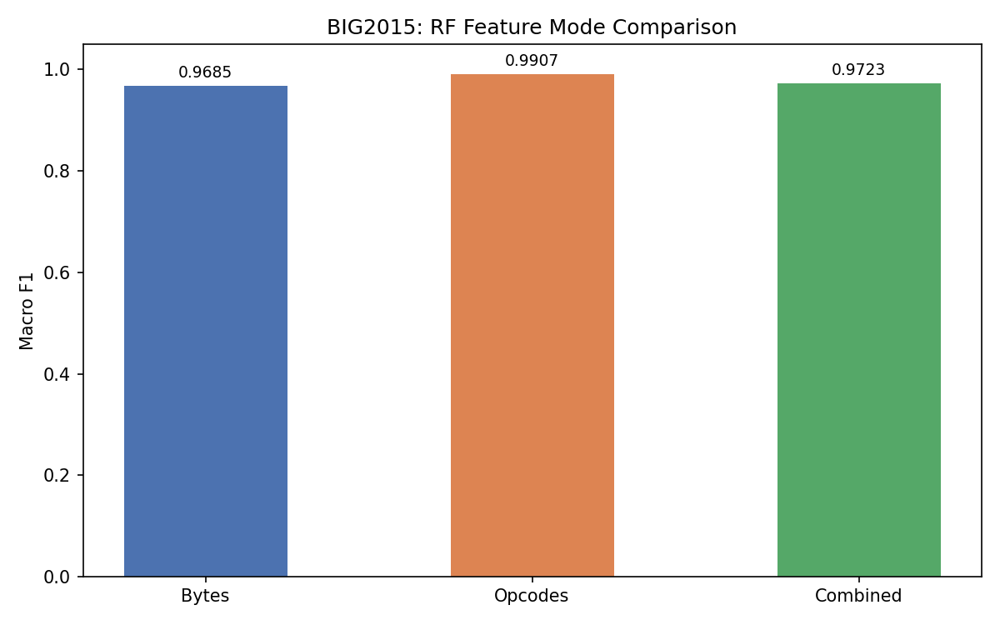

*2: BIG2015 Feature Mode Comparison Bar Chart*


*Figure 3: BIG2015 RF Opcodes Test Set Confusion Matrix*

## 4.2. CIC-MalMem-2022 Binary Detection

Binary classification of malware and benign was first evaluated for the RF to establish the baseline before family level classification.

| Feature Mode | RF Accuracy | RF Macro F1 | MLP Accuracy | MLP Macro F1 |
|:---|:---|:---|:---|:---|
| Static | 99.95% | 0.9995 | 99.82% | 0.9982 |
| Dynamic | 100% | 1.0 | 99.83% | 0.9983 |
| Hybrid | 100% | 1.0 | 99.92% | 0.9993 |

*Table 4.2: Binary detection performance on CIC-MalMem-2022*

Each mode achieved near perfect or perfect binary detection with the RF dynamic and hybrid features each achieving a macro of 1.0 while the MLP was lower it was still above 99.81% across all the modes, indicating binary detection is effectively saturated within this dataset.

The confusion matrix in figure A.2.1 confirms that the static mode was the only one to have any errors, while figures A.2.2 and figure A.2.3 provide evidence of the perfect results of the dynamic and hybrid modes, binary matrices for MLP shown in figure A.4.1-3 show a similar pattern. This further reinforces that the true challenge in the classification of CIC-MalMem-2022 is derived from family classification rather than binary detection.

## 4.3. CIC-MalMem-2022 Random Forest Family Classification

Family level classification on the RF was applied across all 16 classes and showed substantially lower performance when compared to binary detection

| Feature Mode | Accuracy | Macro F1 | Balanced Accuracy |
|:-----------------|:-------------|:-------------|:----------------------|
| Static           | 74.39%       | 0.5207       | 0.5237                |
| Dynamic          | 70.32%       | 0.4393       | 0.4451                |
| Hybrid           | 76.04%       | 0.5514       | 0.5552                |

*Table 4.3: RF family classification performance on the CIC-MalMem-2022 dataset*

The hybrid features achieved the highest macro F1 (0.5514) while static features outperformed dynamic features (0.5207\>0.4393).

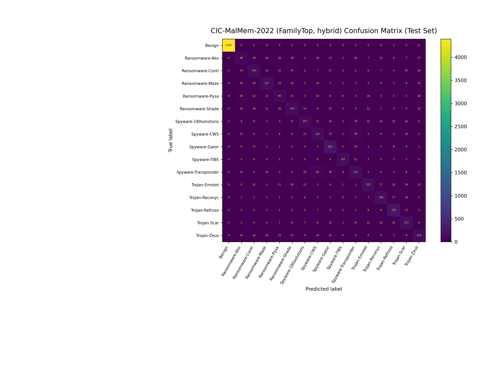

*Figure 4: CIC-MalMem-2022 RF hybrid Family Classification Confusion Matrix. Shows the strong separation of benign samples but weak interpretation between similar malware families*

The confusion matrix highlights how benign samples are easily classified with near perfect accuracy implying that there’s discernable difference between malicious and benign behaviour. However, many of the malware families show extensive misclassification, as shown in figure 4, the classification of Ransomware is the most consistently misclassified with Ransomware-Maze being correctly classed 157 times but gets misclassified as other Ransomware such as Ako and Conti 19 times each, suggesting they’ve got overlapping signatures.

The static and dynamic confusion matrix for each can be found in A.3.1 and A.3.2 and shows how the modes contribute to the result.

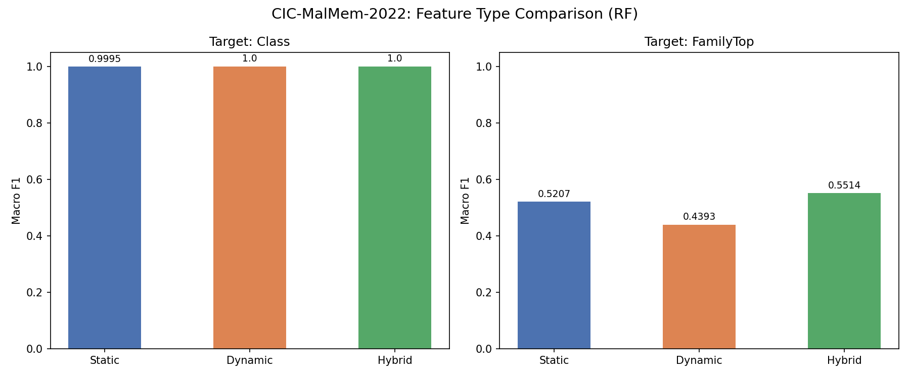

*Figure 5: RF CIC-MalMem-2022 Feature Mode Comparison Bar Graph*

## 4.4. CIC-MalMem-2022 Multi-layer Perceptron

The MLP was evaluated using the CIC-MalMem-2022 dataset across the same feature modes and targets as the RF to allow for a direct comparison.

| Feature Mode | Accuracy | Macro F1 |
|:-----------------|:-------------|:-------------|
| Static           | 65.09%       | 0.3484       |
| Dynamic          | 64.65%       | 0.3272       |
| Hybrid           | 66.71%       | 0.3685       |

*Table 4.4a: MLP family classification performance on CIC-MalMem-2022*

The MLP similar to the RF produced results highlighting the hybrid feature set showing the best results. However, overall, the RF outperformed the MLP across the feature modes.

| Feature Mode | MLP Accuracy | RF Accuracy | Difference | MLP Macro F1 | RF Macro F1 | Difference |
|:---|:---|:---|:---|:---|:---|:---|
| Static | 65.09% | 74.39% | +9.30% | 0.3484 | 0.5207 | +0.1723 |
| Dynamic | 64.65% | 70.32% | +5.67% | 0.3272 | 0.4393 | +0.1121 |
| Hybrid | 66.71% | 76.04% | +9.33% | 0.3685 | 0.5514 | +0.1829 |

*Table 4.4b: RF vs MLP family classification comparison*

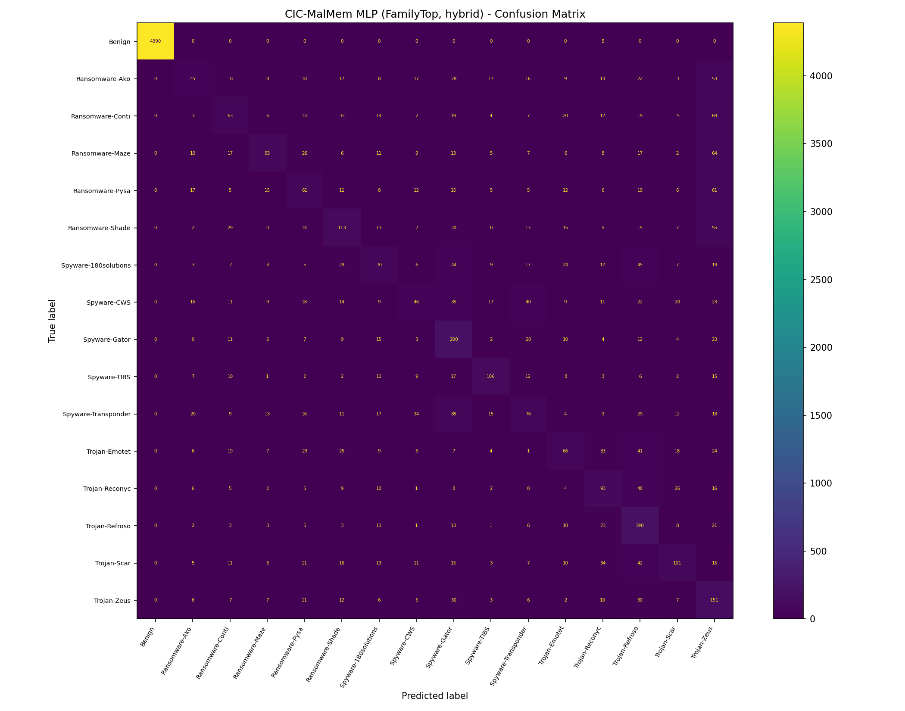

*Figure 6: CIC-MalMem-2022 MLP Hybrid Family Classification Confusion Matrix*

When compared to the RF model the MLP shows a clearly weaker capacity to separate the different malware families. Figure 4 shows a visible diagonal with most of the errors being concentrated around similar sections such as with the ransomware families clustering together, however as shown in figure 6, the MLP shows errors that are more uniformly spread and doesn’t have as visible of a diagonal pathway, this diffusion of errors is also prevalent in the static and dynamic confusion matrixes of the MLP (A.5.1 and A.5.2).

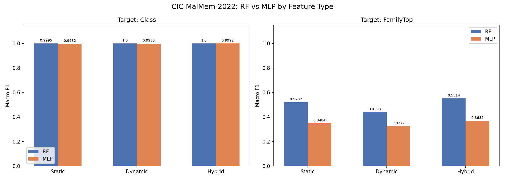

*Figure 7: RF vs MLP Macro F1 comparison on CIC-MalMem-2022 by Feature Type. Binary Classification on the left displays the near perfect performance of both and Family Classification on the right displays the dominance of the RF*

## 4.5. Ensemble

Two ensemble strategies were evaluated using the RF and MLP outputs on the hybrid features to complete family classification: simple averaging and logistic regression stacking. To make sure that the project was consistent, the ensemble used its own standalone RF and MLP model, hence the results differing than those presented previously.

| Model | Accuracy | Balanced Accuracy | Macro F1 |
|:------------------|:-------------|:----------------------|:-------------|
| RF (Stand-alone)  | 75.19%       | 53.86%                | 0.5379       |
| MLP (Stand-alone) | 67.39%       | 39.13%                | 0.3898       |
| Averaging         | 74.30%       | 52.22%                | 0.5196       |
| Stacking          | 74.98%       | 53.43%                | 0.5355       |

*Table 4.5: Comparison of the ensemble methods against stand-alone models*

Neither of the ensemble methods were able to improve upon the stand-alone RF. Averaging was able to produce a macro F1 of 0.5196 which was 0.0183 less compared to the RF while stacking produced a macro F1 of 0.5355 which was less than the stand-alone RF model by 0.0024. The ensemble confusion matrixes under Appendix A.6 provide further insight into these results.

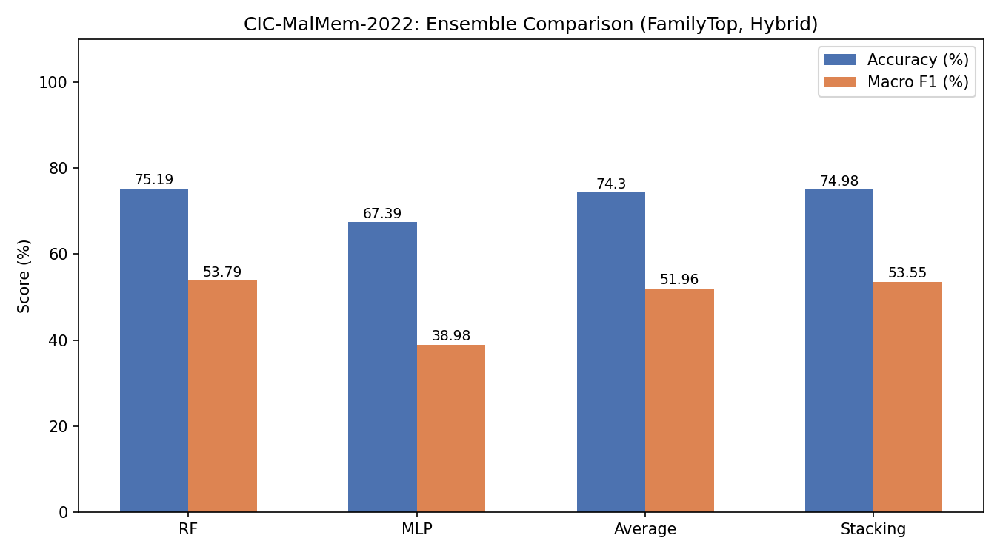

*Figure 8: Ensemble Comparison Bar Graph*

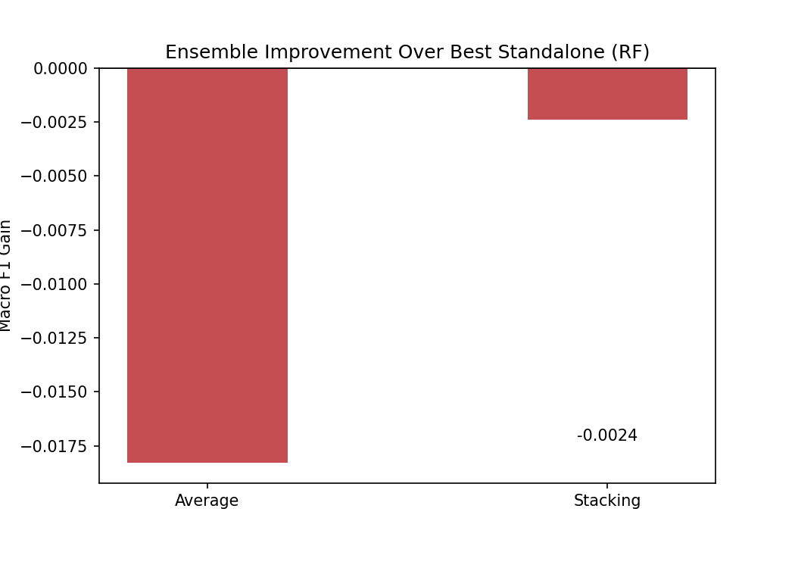

*Figure 9: Ensemble Improvements over the Best Stand-alone Model*

## 4.6. Feature Importance

Feature importance analysis was conducted using the RF to identify which of the features were most influential in classifying the malware into families.

### 4.6.1. BIG2015 Feature Importance Combined

The below table shows the top 10 features ranked by Gini Importance from the combined mode RF that was trained on BIG2015. Importance was distributed evenly across the features with the highest ranked feature (b_0) which represented the frequency of the null byte only scoring 0.0094. Both byte histograms (b\_) and opcode features (op\_) show up in the top 10, which suggests that the combined mode is benefitting from complementary information across both the feature types. The appearance of op_application and op_data in positions 2 and 4 show that high-level PE metadata opcodes carry meaningful power, while the specific byte values such as b_215 and b_207 capture the structural patterns within the raw binary. The b_unk, represented the unknown bytes that the disassembler didn’t manage to resolve. Its high rank suggest that the proportion of unrecognised bytes, usually caused by obfuscation of packing, is a useful signal for distinguishing between malware families.

| Rank | Feature | Gini Importance |
|:---------|:-----------------|:--------------------|
| 1        | b_0              | 0.0094              |
| 2        | op_application   | 0.0077              |
| 3        | b_unk            | 0.0077              |
| 4        | op_data          | 0.0076              |
| 5        | op_os            | 0.0064              |
| 6        | b_215            | 0.0060              |
| 7        | b_207            | 0.0057              |
| 8        | op_nshowcmd      | 0.0057              |
| 9        | op_farproc       | 0.0054              |
| 10       | op_hprevinstance | 0.0054              |

*Table 4.6.1. Top 10 features by Gini Importance combined*

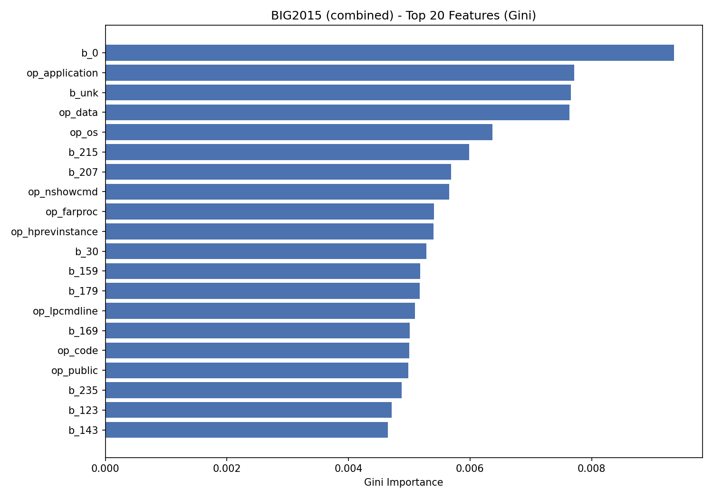

*Figure 10: Top 20 Features Bar Graph Gini Importance*

### 4.6.2. CIC-MalMem-2022 Feature Importance Ensemble

The below table shows the top 10 features ranked by Gini Importance from the ensemble mode RF that was trained on CIC-MalMem-2022. Compared to BIG2015 the importance is concentrated among a smaller number of features with their scores all being above 0.04. The handle-related features take up 6 of the 10 top features with handles.nkey taking the top spot with an importance score of 0.0505, suggesting that the number and type of OS handles held by a process are strong indicators of distinguishing malware families. Features from dlllist and ldrmodules also appear which shows the differing ways that some malware families will load and manage dynamic libraries in memory.

| Rank | Feature | Gini Importance |
|:---------|:-----------------------------|:--------------------|
| 1        | handles.nkey                 | 0.0505              |
| 2        | handles.nevent               | 0.0456              |
| 3        | handles.nsection             | 0.0456              |
| 4        | handles.nfile                | 0.0450              |
| 5        | handles.avg_handles_per_proc | 0.0444              |
| 6        | pslist.avg_handlers          | 0.0427              |
| 7        | dlllist.avg_dlls_per_proc    | 0.0425              |
| 8        | ldrmodules.not_in_mem_avg    | 0.0414              |
| 9        | handles.nhandles             | 0.0412              |
| 10       | ldrmodules.not_in_init_avg   | 0.0409              |

*Table 4.6.2. Top 10 Features by Gini Importance*

<figure>
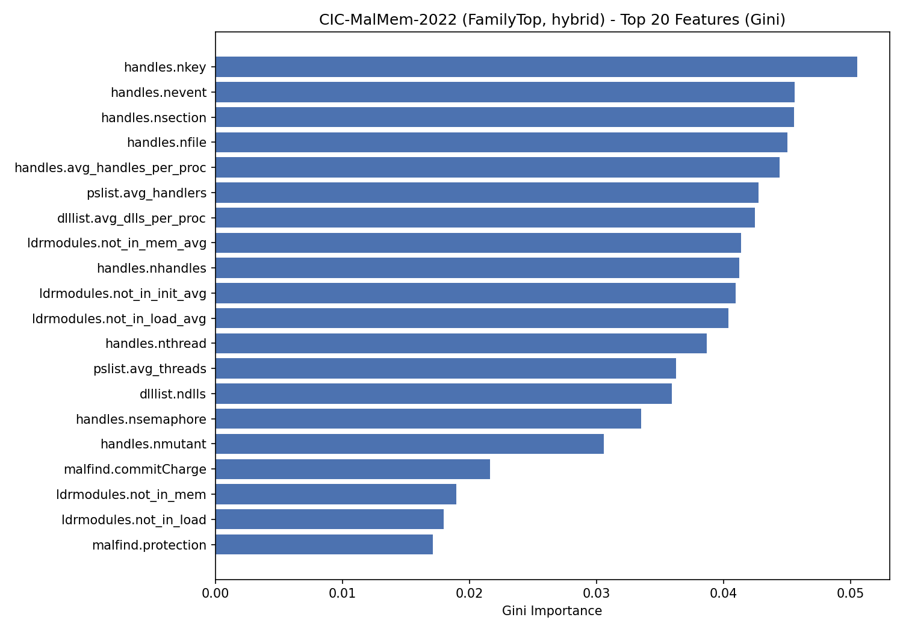
<figcaption><p>Figure 11: Top 20 Features Bar Graph Gini Importance</p></figcaption>
</figure>

## 4.6.3. Agreement Between Methods

Both the Gini importance and the permutation Importance identify features from the handles Volatility plugin as the most influential for family classification. The top three most important features would be: handles.nkey, handles.nevent, handles.nsection as they each appeared in the top 5 for both methods, which shows credence that these were the most discriminative rather than artifacts of one particular measure.


*However, the ranking order did differ between the methods. Gini importance ranked handles.nkey as the highest while permutation ranked handles.nsection top. Futhermore, handles.nevent ranked second by Gini importance but with permutation importance it fell outside of the top 10, while handles.nsemaphore and svcscan.nactive only appeared as important in the permutation analysis.*

Partial agreement is expected due to Gini importance measuring how frequently a feature was used in tree splits during the training, while permutation importance measures the actual impact on macro F1 when a feature was shuffled. Frequently shuffled features that were used in splits frequently might not always have the largest impact on the overall classification performance.

The dominance of handle related features across the two methods suggests that process handle patterns are an important distinguishing characteristic between malware families in memory forensic data.

## 4.7. Summary of Results

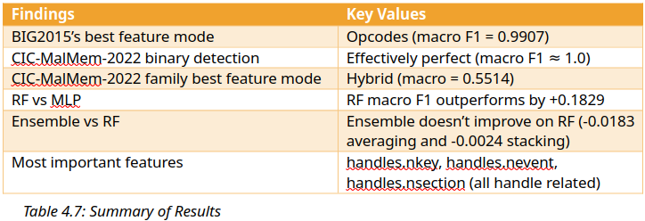

# 5. Discussion

This chapter is for the interpretation of the results in the context of the research question and hypotheses. It evaluates the hypotheses against the evidence and compares the findings to prior work.

## 5.1. Hypothesis Evaluation

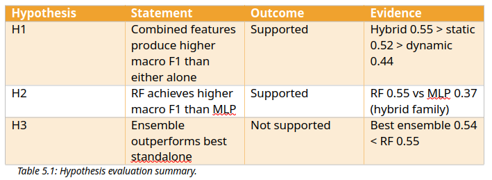

### 5.1.1. Feature Effectiveness

The results demonstrate that feature representation is the primary factor that influences model performance outweighing the impact of model complexity \[12\], \[13\]. This is shown across both datasets where different feature types produced significantly different classification outcomes.

On the BIG2015 dataset the opcode-based features were able to achieve a high macro score of 0.9907, this outperformed both byte histograms and the combination of opcode and byte histograms. This shows that opcode frequencies capture higher-level semantic information that reflects instruction level behaviours and obfuscation patterns, while raw byte distributions represent lower-level structural information. This is consistent with the prior work that demonstrates that opcode and instruction-level features can capture family specific patterns more effectively than raw byte representations \[51\].

The lack of improvement when the byte and opcode features were combined suggests that adding more features might introduce redundancy or noise instead of complimentary information. This is supported by the confusion matrix as the combined mode increased the misclassification's of Obfuscator.ACY which shows that the byte features degraded the performance rather than adding no value.

On CIC-MalMem-2022, the importance of the feature representation gets more pronounced under the more challenging task of classifying into families. While the binary classification achieved near perfect performance across all of the feature modes with a macro of ≈ 1.0. Family classification had a substantial drop with the best result being achieved using hybrid features on the RF resulting in a macro F1 of 0.5514. This shows that the increased difficulty of multi class classification where each malware family might have similar or overlapping characteristics isn’t easily separable \[7\], \[8\].

The hybrid feature set was consistently outperforming both static and dynamic features. Static features such as DLL counts describe what’s present in memory while dynamic features like handle activity and injections capture what the malware is doing. On their own they each show a partial view, but combining them allows for the model to distinguish families that might appear the same in one dimension but different in another. Dynamic features by themselves performed the worst likely because of the handle counts being variable and depend on when the memory snapshot was taken and what was running at the time. This in turn makes them nosier and less stable than static counts.

The confusion matrix in figure 3 shows that the benign samples are classified essentially perfectly. We can see that the RF struggles the most with classifying the ransomware families as they are often misclassified as each other, which suggest that malware families share overlapping memory forensic signatures within the same category, this is what makes categorising malware into their families so difficult.

These findings confirm that hypothesis 1 is supported as the combination of static and dynamic features of the RF resulted in a higher macro F1 score (0.5514) than either the static set (0.5207) or the dynamic set (0.4393). This in turn, enforces the insight that the effectiveness of malware classification is primarily driven more by the features represented than the complexity of the actual model \[12\], \[13\].

### 5.1.2. RF vs MLP

The comparison between the RF and MLP demonstrates that tree-based models are still effective for tabular malware data \[12\], \[13\].

Across all the feature modes on CIC-MalMem-2022 the RF was consistently outperforming the MLP with macroF1 improvements from +0.1121 and +0.1829. The largest gap was observed on the hybrid set where the RF achieved 0.5514 compare to the MLP’s 0.3685 macro F1, which confirmed the second hypothesis and aligned with the existing research showing that neural networks often underperform on structured tabular data \[12\], \[13\].

This is consistent with Grinsztajn et al. who identified three mechanisms explaining the underperformance of neural networks on tabular data \[12\]:

1.  Neural networks aren’t robust to uninformative features which are common in tabular datasets \[12\].

2.  Neural networks fail to preserve feature orientation causing them to struggle with structured feature relationships \[12\].

3.  Neural networks tend to over smooth learned functions and reducing their ability to capture sharp decision boundaries \[12\].

These are observable in the CIC-MalMem-2022 results. Feature importance analysis shows that the importance of features is clustered predominantly to 10 of the 55 features, which means that 45 features contribute very little value, which is a condition where features can degrade performance.

Shwartz-Ziv and Armon demonstrate that even simple MLPs can match more complex deep learning architectures on tabular tasks without any benefit from increasing the model’s complexity \[13\].

On top of this, RF models will naturally capture non-linear feature interactions, are robust to noisy features and don’t require any feature scaling or complex optimisation \[12\], \[18\]. To contrast this the MLP relies on gradient-based learning making it more sensitive to noise, feature scaling and class imbalance.

Tabular data also lacks the spatial or sequential structures that deep learning models would typically exploit \[12\], \[13\]. As a result, MLPs can’t leverage hierarchical feature learning like CNNs or RNNs limiting their advantage over classical ML models.

The RF’s result of 76.04% accuracy is notable when compared to the purpose built GN-BiLSTM architecture by Hussain et al. as it achieved 74.65% on the same dataset, although they were classifying exclusively ransomware \[24\]. The fact a simple tree-based classifier matches a dedicated deep learning model shows that increasing the complexity of models doesn’t always guarantee improved performance when using tabular malware features \[12\], \[13\].

Despite its lower performance, the MLP is still a valid inclusion as a shallow deep learning baseline for the project as it facilitates for a controlled comparison between classical and neural approaches on identical feature representations.

### 5.1.3. Ensemble

The results for the ensemble shows that combining an RF with an MLP for predictions didn’t improve the performance compared to the stand-alone RF, as both the averaging and stacking methods performed worse than the baseline RF.

These results confirmed that the third hypothesis isn’t supported by highlighting the key limitations of ensemble learning, their need for diverse and complementary error patterns to be effective. Kuncheva argues that diversity in classifiers is necessary for ensembles to benefit, so when they make correlated predictions combining these predictions gives limited or no improvement \[40\]. The ensemble provides evidence for the lack of diversity in its confusion matrix. When comparing the standalone RF and the baseline MLP both struggle with the same ransomware families so rather than complementing each other, the errors are overlapping causing the increase in misclassification. This is supported in the literature where fusion improves performance in a minority of cases, especially in multi-class tasks \[40\].

During the experiment the MLP consistently underperformed when compared to the RF, meaning that the predictions that it introduced created noise in the system rather than providing useful information which subsequently caused the RF to produce worse predictions as they were trained on the same features. Yoo et al. also used an ensemble for the AI-HydRa and were able to get improvements due to the models trained on different feature spaces, their RF was also trained on tabular features however their neural network was trained on image representations \[10\]. In the project both the RF and MLP are operating on the same 55 tabular features which doesn’t provide the necessary diversity identified by Kuncheva \[40\].

Ensemble model’s without diversity in either their behaviour or feature representations can’t provide meaningful gains \[40\].

In the experiment the stacking approach was able to be slightly better than the average method. Although both still failed to produce a result better than the RF the result provides evidence that model fusions fail under specific conditions, demonstrating that a hybrid approach isn’t inherently superior and needs justification based on model diversity and data representation \[40\].

## 5.2. Comparison with Prior Work

The findings in the study are consistent with prior research in both malware classification and tabular machine learning \[12\], \[13\], \[23\], \[24\].

The BIG2015 dataset achieves near perfect performance when using opcode features which aligns with the studies reporting high accuracy with engineered static features, suggesting that the dataset is well understood \[11\], \[21\].

For CIC-MalMem-2022, the results highlight the difficulty of family level classification compared to binary detection \[23\], \[24\]. When the results are compared to some prior work completed on the dataset the RF on the hybrid feature set falls below the best reported family level results:

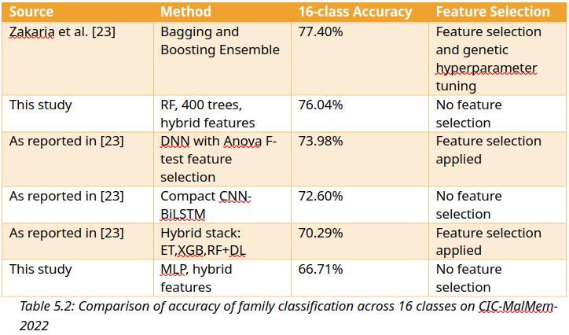

The RF in the study falls only 1.36% below Zakaria et al.’s optimised ensemble’s \[23\], achieving this result without feature optimisation suggests that the RF is robust to noise on this dataset and that aggressively pre-processing might not be necessary to be competitive. The study also does better than the DNN, CNN-BiLSTM and hybrid stack reported in the same study, all of which are a more complex architecture. This reinforces the findings by Grinsztajn et al. and Shwartz-Ziv and Armon that tree-based models remain competitive on tabular data without needing the architectural complexity of deep learning approaches \[12\], \[13\].

The ensemble methods lack of improvement is consistent with Kuncheva \[40\]. They argue that fusion only provides a meaningful gain when the models have sufficient diversity in their error patterns. This is shown with studies that report successful hybrid models, such as AI-HydRa, as they’ll usually combine different feature modalities such as tabular and image representations \[10\].

In this study it shows that an ensemble operating on the same feature space will offer limited benefits, as the RF and MLP were both operating on the exact same tabular features \[40\].

## 5.3. Feature Importance

The analysis of Gini importance identified that handle-related features such as handles.nkey, handles.nevent and handles.nsection are the most discriminative when it came to family classification on CIC-MalMem-2022. This suggests that the number and type of OS handles held by a process were strong indicators of the malware’s family, which is in line with the behavioural differences between malware families in the ways in which they interact with system resources \[22\].

For BIG2015 importance was distributed more evenly across both byte and opcode features, with the null byte frequency ranking the highest (b_0). This supports the findings that the combined feature mode didn’t improve on opcodes alone as the inclusion of bytes didn’t contribute much discriminative power.

## 5.4. CNN to MLP Pivot

The initial design of the project considered the use of a Convolutional Neural Network (CNN) as the deep learning component, this was reconsidered due to the nature of the data. On top of that, implementing a CNN on the CIC-MalMem-2022 dataset would require transforming the tabular features into an image or a grid representation, this would artificially impose spatial relationships that don’t exist on the original data, for example features like handles.nkey and ldrmodules.not_in_mem_avg are unrelated aspects of processes and having them next to one another in a grid might impose a spatial relationship between the two that don’t exist in the data.

By doing this transformation of the data it would make any comparison between the CNN and RF results more difficult to interpret and as such the potential differences in performance could be attributed to either the architecture of the model or the data transformation, further complicating analysis. By using an MLP which operates on tabular data like the RF, any comparisons isolates the effects of model architecture. The final results validate the decision as even an MLP which is suited to tabular data underperformed suggesting that a CNN would be unlikely to improve on either model

## 5.5. Limitations

The study relies on pre-extracted features, which limits the ability for analysing raw behavioural data such as API call sequences or execution traces. Additionally, BIG2015 is outdated and contains malware families from 2015 which may not be representative of the modern threat landscape of malware. CIC-MalMem-2022, while more recent uses synthetic memory dumps generated via Volatility plugins instead of real-world memory captures, limiting how well it would work in real-world conditions.

The deep learning component was limited to a shallow MLP on sklearn’s MLPClassifier, which doesn’t allow for GPU training. While the choice in using an MLP was intentional to allow for a fair comparison it fails to capture the full capabilities of modern deep learning architectures such as CNNs.

Explainability was only applied to the RF model. SHAP was attempted however this failed due to the computational constraints when computing SHAP values across the full feature sets. Permutation importance was not extended to the MLP the lack of interpretability for the MLP reduces the capacity to fully understand its decision-making process.

Lastly, adversarial robustness wasn’t evaluated. Malware is inherently adversarial and models might be vulnerable to evasion techniques which wasn’t explored in the study.

## 5.6. Further Work

Future work should focus on addressing these limitations and extending the scope of the study while using more recent or a more diverse dataset to assess model generalisation in more realistic settings. Also evaluating for adversarial robustness and resilience to obfuscation techniques would enhance the practical relevance of the work in real-world cybersecurity applications.

# 6. Conclusion

The study evaluated whether malware family classification was more effective while using individual models or hybrid approaches while also assessing the impact of feature representation on classification performance.

The hypotheses were evaluated in the following ways:

- Hypothesis one: This was supported through the hybrid features having a macro F1 score of 0.5514 whilst the static and dynamic each had 0.5207 and 0.4393 respectively.

- Hypothesis two: his was also supported by the RF consistently outperforming the MLP across all the feature modes and having improvements ranging from +0.1121 to +0.1829 macro F1, which aligns with the established research \[12\], \[13\].

- Hypothesis three: This however was not supported as neither the averaging or stacking methods improved over the standalone RF, which demonstrated that ensemble methods require model diversity to be most effective \[40\].

This project was able to answer the research question proposed due to malware family classification being more effectively performed when using individual models instead of a hybrid ensemble approach. The RF was able to consistently outperform both the ensemble methods across all the feature modes, which indicated that the combination’s don’t compensate for the gap in performance between a strong classifier and a weak classifier on tabular data.

The choice of features was the most important aspect to the performance in classification, more than model complexity which has practical implications in malware analysis as it suggests that efforts should be directed towards improving feature extraction and representation rather than increasing model complexity \[12\], \[13\].

While it achieved its objectives, limitations include reliance on pre-extracted features, the use of an MLP which was incapable of showing the full capabilities of modern deep learning, the use of datasets that can’t reflect the full scale of modern malware and its evolution and the lack of evaluation for adversarial robustness represent a clear direction for future research.

# 7. Legal, Social, Ethical and Professional Issues

## 7.1. Legal

All the datasets used are publicly available and the use of them complies with their respective licensing terms, no live malware was executed or distributed which complies with computer misuse legislation. The datasets don’t contain any personal or identifiable information and all experiments were conducted using pre-extracted features which reduces the risks associated with handling raw malware binaries.

## 7.2. Social

Malware classification research helps contribute to improving cybersecurity defences for individuals, organisations and critical infrastructure. There’s an inherent risk of dual use as the research could be used for adversarial evasion strategies however this risk was mitigated with the focus being on classification rather than vulnerability specific analysis. A safer digital environment is supported through the advancement of knowledge on malware behaviour and family attribution.

## 7.3. Ethical

The ethical considerations are on the handling of malware safely and the fairness of model evaluation. These risks were mitigated through the use of pre-extracted malware instead of executing live malware.

## 7.4. Professional

The project adheres to professional standards in research through honest reporting of results, such as the inclusion of the negative findings. Explainability through feature importance analysis supports the interpretability expected in security-critical applications.

## 7.5. Sustainable Development Goals (SDG)

The project aligns with SDG 9 which is about industry, innovation and infrastructure and SDG 16 about peace, justice and strong institutions through supporting efforts to combat against cybercrime. Effective malware classification is important for protecting digital infrastructure that our modern society depends on.

# Appendix A: Confusion Matrices

## A.1 BIG2015 – Random Forest

### A.1.1 BIG2015 – RF (Byte Histogram Features)

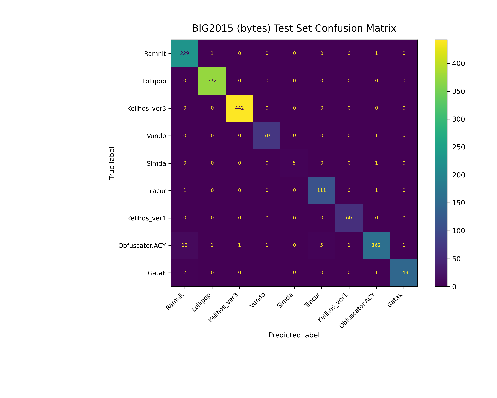

*Figure A.1: BIG2015 RF Byte Histogram Test Set Confusion Matrix*

### 

### A.1.2 BIG2015 – RF (Combined Features)


**Figure A.1.2: BIG2015 RF Combined Features Test Set Confusion Matrix**

*Note: The BIG2015 RF Opcode Features confusion matrix is presented as Figure 2 in the main report.*

## A.2 CIC-MalMem-2022 – RF Binary Detection

### A.2.1 RF Binary – Static Features


*Figure A.2.1: CIC-MalMem-2022 RF Binary Detection – Static Features*

### A.2.2 RF Binary – Dynamic Features

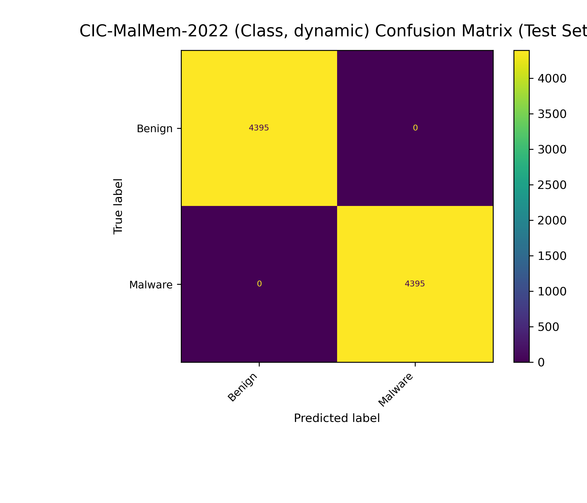

*Figure A.2.2: CIC-MalMem-2022 RF Binary Detection – Dynamic Features*

### A.2.3 RF Binary – Hybrid Features


*Figure A.2.3: CIC-MalMem-2022 RF Binary Detection – Hybrid Features*

## A.3 CIC-MalMem-2022 – RF Family Classification

### A.3.1 RF Family – Static Features


*Figure A.3.1: CIC-MalMem-2022 RF Family Classification – Static Features*

### A.3.2 RF Family – Dynamic Features


*Figure A.3.2: CIC-MalMem-2022 RF Family Classification – Dynamic Features*

*Note: The CIC-MalMem-2022 RF Family Classification (Hybrid Features) confusion matrix is presented as Figure 3 in the main report.*

## A.4 CIC-MalMem-2022 – MLP Binary Detection

### A.4.1 MLP Binary – Static Features

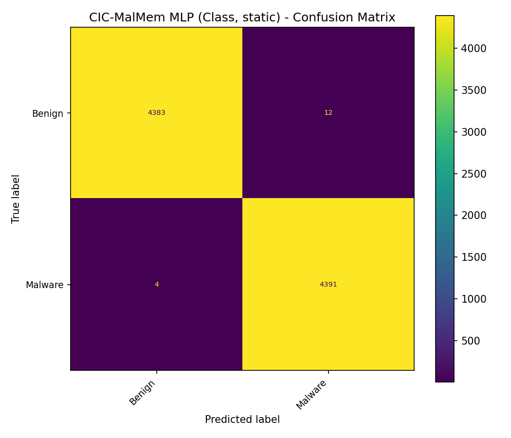

*Figure A.4.1: CIC-MalMem-2022 MLP Binary Detection – Static Features*

### A.4.2 MLP Binary – Dynamic Features


*Figure A.4.2: CIC-MalMem-2022 MLP Binary Detection – Dynamic Features*

### A.4.3 MLP Binary – Hybrid Features


*Figure A.4.3: CIC-MalMem-2022 MLP Binary Detection – Hybrid Features*

## A.5 CIC-MalMem-2022 – MLP Family Classification

### A.5.1 MLP Family – Static Features


*Figure A.5.1: CIC-MalMem-2022 MLP Family Classification – Static Features*

### A.5.2 MLP Family – Dynamic Features


*Figure A.5.2: CIC-MalMem-2022 MLP Family Classification – Dynamic Features*

*Note: The CIC-MalMem-2022 MLP Family Classification (Hybrid Features) confusion matrix is presented as Figure 5 in the main report.*

## A.6 CIC-MalMem-2022 – Ensemble

### A.6.1 Ensemble – RF Baseline

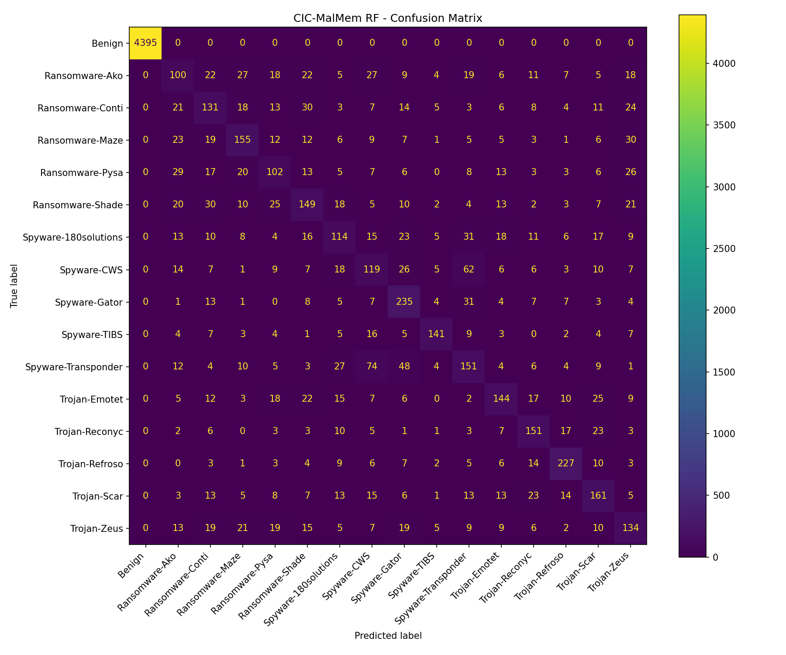

*Figure A.6.1: Ensemble RF Baseline – Family Classification (Hybrid Features)*

### A.6.2 Ensemble – MLP Baseline


*Figure A.6.2: Ensemble MLP Baseline – Family Classification (Hybrid Features)*

### A.6.3 Ensemble – Simple Averaging


*Figure A.6.3: Ensemble Simple Averaging – Family Classification (Hybrid Features)*

### A.6.4 Ensemble – Logistic Regression Stacking

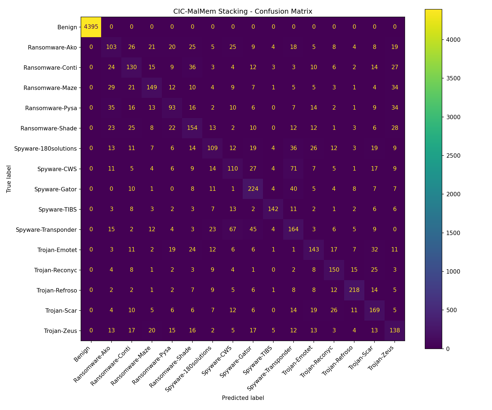

*Figure A.6.4: Ensemble Logistic Regression Stacking – Family Classification (Hybrid Features)*

# Appendix B: Feature Importance Data

## B.1 BIG2015 – Gini Feature Importance (Top 20)


*Figure B.1: BIG2015 Top 20 Features by Gini Importance (Combined Mode)*

**Table B.1: BIG2015 Top 20 Features by Gini Importance**

| Feature | Gini Importance |
|------------------|---------------------|
| b_0              | 0.009354            |
| op_application   | 0.007713            |
| b_unk            | 0.007661            |
| op_data          | 0.007633            |
| op_os            | 0.006372            |
| b_215            | 0.005989            |
| b_207            | 0.005692            |
| op_nshowcmd      | 0.005654            |
| op_farproc       | 0.005404            |
| op_hprevinstance | 0.005403            |
| b_30             | 0.005279            |
| b_159            | 0.005183            |
| b_179            | 0.005176            |
| op_lpcmdline     | 0.005090            |
| b_169            | 0.005009            |
| op_code          | 0.004998            |
| op_public        | 0.004986            |
| b_235            | 0.004878            |
| b_123            | 0.004712            |
| b_143            | 0.004645            |

## B.2 BIG2015 – Permutation Importance (Top 20)

**Table B.2: BIG2015 Top 20 Features by Permutation Importance**

| Feature | Importance Mean | Importance Std |
|------------------|---------------------|--------------------|
| op_pusha         | 0.000567            | 0.000000           |
| b_38             | 0.000378            | 0.000267           |
| b_105            | 0.000378            | 0.000267           |
| b_119            | 0.000378            | 0.000267           |
| op_lpvoid        | 0.000315            | 0.000267           |
| b_unk            | 0.000237            | 0.000241           |
| op_void          | 0.000158            | 0.000112           |
| b_177            | 0.000145            | 0.000000           |
| b_98             | 0.000145            | 0.000000           |
| op_popa          | 0.000145            | 0.000000           |
| b_27             | 0.000145            | 0.000000           |
| b_109            | 0.000145            | 0.000000           |
| op_lpwidecharstr | 0.000145            | 0.000000           |
| b_121            | 0.000145            | 0.000000           |
| b_159            | 0.000145            | 0.000000           |
| b_174            | 0.000145            | 0.000000           |
| b_182            | 0.000145            | 0.000000           |
| b_202            | 0.000145            | 0.000000           |
| b_183            | 0.000145            | 0.000000           |
| b_146            | 0.000145            | 0.000000           |

## B.3 CIC-MalMem-2022 – Gini Feature Importance


*Figure B.3: CIC-MalMem-2022 Top 20 Features by Gini Importance (Hybrid)*

**Table B.3: CIC-MalMem-2022 All Features by Gini Importance**

| feature | Gini Importance |
|----------------------------------------|---------------------|
| handles.nkey                           | 0.050523            |
| handles.nevent                         | 0.045594            |
| handles.nsection                       | 0.045557            |
| handles.nfile                          | 0.045040            |
| handles.avg_handles_per_proc           | 0.044408            |
| pslist.avg_handlers                    | 0.042722            |
| dlllist.avg_dlls_per_proc              | 0.042465            |
| ldrmodules.not_in_mem_avg              | 0.041376            |
| handles.nhandles                       | 0.041239            |
| ldrmodules.not_in_init_avg             | 0.040938            |
| ldrmodules.not_in_load_avg             | 0.040364            |
| handles.nthread                        | 0.038684            |
| pslist.avg_threads                     | 0.036241            |
| dlllist.ndlls                          | 0.035938            |
| handles.nsemaphore                     | 0.033496            |
| handles.nmutant                        | 0.030587            |
| malfind.commitCharge                   | 0.021604            |
| ldrmodules.not_in_mem                  | 0.018944            |
| ldrmodules.not_in_load                 | 0.017966            |
| malfind.protection                     | 0.017120            |
| malfind.ninjections                    | 0.016710            |
| callbacks.ncallbacks                   | 0.016411            |
| malfind.uniqueInjections               | 0.015577            |
| ldrmodules.not_in_init                 | 0.015268            |
| svcscan.nservices                      | 0.013812            |
| psxview.not_in_deskthrd_false_avg      | 0.013274            |
| svcscan.nactive                        | 0.012163            |
| handles.ntimer                         | 0.011934            |
| svcscan.shared_process_services        | 0.011926            |
| psxview.not_in_csrss_handles_false_avg | 0.011287            |
| pslist.nppid                           | 0.010781            |
| psxview.not_in_session_false_avg       | 0.010665            |
| svcscan.kernel_drivers                 | 0.010491            |
| handles.ndirectory                     | 0.010123            |
| psxview.not_in_ethread_pool_false_avg  | 0.010057            |
| psxview.not_in_deskthrd                | 0.009319            |
| psxview.not_in_pslist_false_avg        | 0.008893            |
| psxview.not_in_pspcid_list_false_avg   | 0.008767            |
| pslist.nproc                           | 0.008119            |
| psxview.not_in_csrss_handles           | 0.007519            |
| psxview.not_in_ethread_pool            | 0.007492            |
| psxview.not_in_session                 | 0.006776            |
| psxview.not_in_pslist                  | 0.006772            |
| psxview.not_in_pspcid_list             | 0.006665            |
| handles.ndesktop                       | 0.006123            |
| svcscan.process_services               | 0.001654            |
| callbacks.nanonymous                   | 0.000289            |
| modules.nmodules                       | 0.000141            |
| psxview.not_in_eprocess_pool_false_avg | 0.000077            |
| psxview.not_in_eprocess_pool           | 0.000058            |
| callbacks.ngeneric                     | 0.000028            |
| svcscan.fs_drivers                     | 0.000024            |
| pslist.nprocs64bit                     | 0.000000            |
| handles.nport                          | 0.000000            |
| svcscan.interactive_process_services   | 0.000000            |

## B.4 CIC-MalMem-2022 – Permutation Importance (Family, Hybrid)

**Table B.4: CIC-MalMem-2022 All Features by Permutation Importance**

| Feature | Importance Mean | Importance Std |
|----|----|----|
| handles.nsection | 0.050843 | 0.001705 |
| handles.nkey | 0.036203 | 0.002384 |
| handles.nfile | 0.035334 | 0.003322 |
| dlllist.avg_dlls_per_proc | 0.017038 | 0.001703 |
| handles.nsemaphore | 0.015908 | 0.002127 |
| svcscan.nactive | 0.014089 | 0.001068 |
| handles.nmutant | 0.013493 | 0.001813 |
| malfind.commitCharge | 0.009759 | 0.001675 |
| pslist.avg_threads | 0.009413 | 0.001529 |
| callbacks.ncallbacks | 0.008717 | 0.001752 |
| handles.nevent | 0.008260 | 0.001217 |
| ldrmodules.not_in_init_avg | 0.006543 | 0.001893 |
| dlllist.ndlls | 0.006468 | 0.000973 |
| malfind.uniqueInjections | 0.006257 | 0.001404 |
| ldrmodules.not_in_load_avg | 0.006028 | 0.001495 |
| svcscan.nservices | 0.005899 | 0.001880 |
| ldrmodules.not_in_mem_avg | 0.005649 | 0.001213 |
| malfind.ninjections | 0.005211 | 0.001234 |
| svcscan.shared_process_services | 0.005097 | 0.001102 |
| ldrmodules.not_in_load | 0.004581 | 0.001582 |
| svcscan.kernel_drivers | 0.004450 | 0.001129 |
| malfind.protection | 0.004442 | 0.000962 |
| pslist.nppid | 0.002658 | 0.000926 |
| ldrmodules.not_in_mem | 0.002223 | 0.002219 |
| handles.ntimer | 0.000904 | 0.000807 |
| handles.avg_handles_per_proc | 0.000660 | 0.001788 |
| callbacks.nanonymous | 0.000560 | 0.000002 |
| callbacks.ngeneric | 0.000000 | 0.000000 |
| svcscan.interactive_process_services | 0.000000 | 0.000000 |
| psxview.not_in_eprocess_pool_false_avg | 0.000000 | 0.000000 |
| handles.nport | 0.000000 | 0.000000 |
| pslist.nprocs64bit | 0.000000 | 0.000000 |
| svcscan.fs_drivers | 0.000000 | 0.000000 |
| psxview.not_in_eprocess_pool | 0.000000 | 0.000000 |
| modules.nmodules | -0.000079 | 0.000103 |
| psxview.not_in_deskthrd_false_avg | -0.000174 | 0.001087 |
| svcscan.process_services | -0.000185 | 0.000365 |
| psxview.not_in_pspcid_list | -0.000475 | 0.000559 |
| handles.ndirectory | -0.000555 | 0.000729 |
| psxview.not_in_pslist_false_avg | -0.000618 | 0.000769 |
| psxview.not_in_pslist | -0.000705 | 0.000434 |
| psxview.not_in_session | -0.000722 | 0.000940 |
| handles.ndesktop | -0.000929 | 0.000682 |
| psxview.not_in_pspcid_list_false_avg | -0.001038 | 0.000637 |
| psxview.not_in_ethread_pool | -0.001053 | 0.000773 |
| ldrmodules.not_in_init | -0.001077 | 0.000762 |
| pslist.avg_handlers | -0.001111 | 0.001502 |
| pslist.nproc | -0.001241 | 0.000662 |
| psxview.not_in_csrss_handles_false_avg | -0.001311 | 0.000931 |
| psxview.not_in_csrss_handles | -0.001314 | 0.000730 |
| psxview.not_in_ethread_pool_false_avg | -0.001341 | 0.000812 |
| psxview.not_in_deskthrd | -0.001343 | 0.000961 |
| handles.nhandles | -0.001570 | 0.001192 |
| psxview.not_in_session_false_avg | -0.001892 | 0.001039 |
| handles.nthread | -0.003587 | 0.001396 |

# Appendix C: Complete Scripts

The complete scripts are in the [`Scripts/`](../Scripts) folder of this repository:

- C.1 [`Big15-RF.py`](../Scripts/Big15-RF.py)
- C.2 [`CIC_Malmem-RF.py`](../Scripts/CIC_Malmem-RF.py)
- C.3 [`CIC-MalMem-MLP.py`](../Scripts/CIC-MalMem-MLP.py)
- C.4 [`Ensemble-CIC-MalMem.py`](../Scripts/Ensemble-CIC-MalMem.py)

# References

\[1\] S. Berrios, D. Leiva, B. Olivares, H. Allende-Cid, and P. Hermosilla, ‘Systematic Review: Malware Detection and Classification in Cybersecurity’, Applied Sciences, vol. 15, no. 14, p. 4747, 2025, doi: 10.3390/app15134747.

\[2\] R. Vinayakumar, M. Alazab, K. P. Soman, P. Poornachandran, and S. Venkatraman, ‘Robust Intelligent Malware Detection Using Deep Learning’, IEEE Access, vol. 7, pp. 46717–46738, 2019, doi: 10.1109/ACCESS.2019.2906934.

\[3\] Z. Jabeen, K. Mishra, M. K. Mishra, and B. K. Mishra, ‘Malware Detection Using Artificial Intelligence: Techniques, Research Issues and Future Directions’, Int. J. Eng. Adv. Technol., vol. 14, no. 1, pp. 1–5, Oct. 2024, doi: 10.35940/ijeat.A4531.14011024.

\[4\] H. Rathore, S. Agarwal, S. K. Sahay, and M. Sewak, ‘Malware Detection Using Machine Learning and Deep Learning’, in Proc. 6th Int. Conf. Big Data Analytics (BDA 2018), Warangal, India, Dec. 2018, pp. 211–220, doi: 10.1007/978-3-030-04780-1_28.

\[5\] M. Gopinath and S. C. Sethuraman, ‘A Comprehensive Survey on Deep Learning Based Malware Detection Techniques’, Computer Science Review, vol. 47, p. 100529, 2023, doi: 10.1016/j.cosrev.2022.100529.

\[6\] D. Gavrilut, M. Cimpoesu, D. Anton, and L. Ciortuz, ‘Malware Detection Using Machine Learning’, in Proc. Int. Multiconference on Computer Science and Information Technology, 2009, pp. 735–741, doi: 10.1109/IMCSIT.2009.5352759.

\[7\] S. K. Smmarwar, G. P. Gupta, and S. Kumar, ‘Android Malware Detection and Identification Frameworks by Leveraging the Machine and Deep Learning Techniques: A Comprehensive Review’, Telematics and Informatics Reports, vol. 14, p. 100130, 2024, doi: 10.1016/j.teler.2024.100130.

\[8\] O. Aslan and A. A. Yilmaz, ‘A New Malware Classification Framework Based on Deep Learning Algorithms’, IEEE Access, vol. 9, pp. 87936–87951, 2021, doi: 10.1109/ACCESS.2021.3089586.

\[9\] M. A. Albahar, M. S. ElSayed, and A. Jurcut, ‘A Modified ResNeXt for Android Malware Identification and Classification’, Computational Intelligence and Neuroscience, vol. 2022, p. 8634784, May 2022, doi: 10.1155/2022/8634784.

\[10\] S. Yoo, S. Kim, S. Kim, and B. B. Kang, ‘AI-HydRa: Advanced Hybrid Approach Using Random Forest and Deep Learning for Malware Classification’, Information Sciences, vol. 546, pp. 420–435, 2021, doi: 10.1016/j.ins.2020.08.082.

\[11\] H. Deng, C. Guo, G. Shen, Y. Cui, and Y. Ping, ‘MCTVD: A Malware Classification Method Based on Three-Channel Visualization and Deep Learning’, Computers & Security, vol. 126, p. 103084, 2023, doi: 10.1016/j.cose.2023.103084.

\[12\] L. Grinsztajn, E. Oyallon, and G. Varoquaux, ‘Why Do Tree-Based Models Still Outperform Deep Learning on Typical Tabular Data?’, in Proc. NeurIPS Datasets and Benchmarks, 2022. \[Online\]. Available: arXiv:2207.08815.

\[13\] R. Shwartz-Ziv and A. Armon, ‘Tabular Data: Deep Learning Is Not All You Need’, Information Fusion, vol. 81, pp. 84–90, 2022. \[Online\]. Available: arXiv:2106.11959.

\[14\] S. U. Qureshi, J. He, S. Tunio, N. Zhu, A. Nazir, A. Wajahat, F. Ullah, and A. Wadud, ‘Systematic Review of Deep Learning Solutions for Malware Detection and Forensic Analysis in IoT’, J. King Saud Univ.-Comput. Inf. Sci., vol. 36, no. 8, p. 102164, 2024, doi: 10.1016/j.jksuci.2024.102164. 2.1.4 “interpretability important” Samek (Explainable AI)

\[15\] V. Ravi, M. Alazab, K. P. Soman, S. Srinivasan, S. Venkatraman, V. Q. Pham, and S. Ketha, ‘Deep Learning for Cyber SecurityApplications: A Comprehensive Survey’, TechRxiv Preprint, Oct. 2021, doi: 10.36227/techrxiv.16748161.

\[16\] Y. Wu, H. Zhuang, Y. Jia, and Y. Zhang, ‘A Survey of Machine Learning Approaches for Malware Detection’, in Proc. 5th Int. Conf. Computer Network Security and Software Engineering (CNSSE), Qingdao, China, Feb. 2025, pp. 1–5, doi: 10.1145/3732365.3732410.

\[17\] J. Subramanian and R. Khilar, ‘Detection and Classification of Malware for Cyber Security Using Machine Learning Algorithms’, in Proc. Int. Conf. Science, Technology, Engineering and Management (ICONSTEM), Apr. 2023, doi: 10.1109 ICONSTEM56934.2023.10142575.

\[18\] L. Breiman, ‘Random Forests’, Machine Learning, vol. 45, no. 1, pp. 5–32, 2001.

\[19\] Z. Zhang, P. Qi, and W. Wang, ‘Dynamic Malware Analysis with Feature Engineering and Feature Learning’, in Proc. AAAI Conf. on Artificial Intelligence, vol. 34, no. 1, pp. 1210–1217, 2020, doi: 10.1609/aaai.v34i01.5474.

\[20\] M. Almadaien, M. Abudir, S. Kovaco, and M. Alkassabeh, ‘Evaluation of Machine Learning Algorithms for Intrusion Detection System’, 2024.

\[21\] R. Ronen, M. Radu, C. Feuerstein, E. Yom-Tov, and M. Ahmadi, ‘Microsoft Malware Classification Challenge’, 2018. \[Online\]. Available: arXiv:1802.10135.

\[22\] T. Carrier, P. Victor, A. Tekeoglu, and A. H. Lashkari, ‘Detecting Obfuscated Malware using Memory Feature Engineering’, in Proc. 8th Int. Conf. Information Systems Security and Privacy (ICISSP 2022), SCITEPRESS, 2022, pp. 177–188, doi: 10.5220/0010908200003120.

\[23\] M. Zakaria, M. S. Mohamed, S. Hussein, and G. I. Salama, ‘Obfuscated File-Less Malware Detection Using Integrating Memory Forensics Data with Machine Learning Techniques’, Applied Computing and Informatics, 2025, doi: 10.1108 ACI-02-2025-0052.

\[24\] A. Hussain, A. Saadia, M. Alhussein, A. Gul, and K. Aurangzeb, ‘Enhancing Ransomware Defense: Deep Learning-Based Detection and Family-Wise Classification of Evolving Threats’, PeerJ Computer Science, vol. 10, p. e2546, 2024, doi: 10.7717 peerj-cs.2546.

\[25\] K. P. M. Shafi, P. Vinod, K. A. R. Rehiman, and A. Guerra-Manzanares, ‘HExNet: Enhancing Malware Classification Through Hierarchical CNNs and Multilevel Feature Attribution’, Journal of Information Security and Applications, vol. 94, p. 104207, 2025, doi: 10.1016/j.jisa.2025.104207.

\[26\] P. Singh, R. Kumar, and S. K. Singh, ‘Application of Deep Learning in Malware Detection: A Review’, J. King Saud Univ. Comput. Inf. Sci., vol. 34, no. 9, pp. 6423–6439, 2022, doi: 10.1016/j.jksuci.2022.03.014.

\[27\] N. Bhardwaj, S. Sharma, and R. Kumar, ‘A Novel Deep Learning-Based Approach for Malware Detection’, Engineering Applications of Artificial Intelligence, vol. 126, p. 107130, 2024, doi: 10.1016/j.engappai.2023.107130.

\[28\] S. Anand, B. Mitra, S. Dey, A. Rao, R. Dhar, and J. Vaidya, ‘MALITE: Lightweight Malware Detection and Classification for Constrained Devices’, IEEE Transactions on Emerging Topics in Computing, vol. 13, no. 3, pp. 1099–1112, Jul.–Sept. 2025, doi: 10.1109/TETC.2025.3566370.

\[29\] L. Nataraj, S. Karthikeyan, G. Jacob, and B. S. Manjunath, ‘Malware Images: Visualization and Automatic Classification’, in Proc. 8th Int. Symp. Visualization for Cyber Security (VizSec), New York, NY, USA: ACM, Jul. 2011, doi: 10.1145/2016904.2016908.

\[30\] J. Singh, D. Thakur, F. Ali, T. Gera, and K. S. Kwak, ‘Deep Feature Extraction and Classification of Android Malware Images’, Sensors, vol. 20, no. 24, p. 7013, Dec. 2020, doi: 10.3390/s20247013.

\[31\] D. Vasan, M. Alazab, S. Wassan, B. Safaei, and Q. Zheng, ‘Image-Based Malware Classification Using Ensemble of CNN Architectures (IMCEC)’, Computers & Security, vol. 92, p. 101748, May 2020, doi: 10.1016/j.cose.2020.101748.

\[32\] C. Li, Z. Cheng, H. Zhu, L. Wang, Q. Lv, Y. Wang, N. Li, and D. Sun, ‘DMalNet: Dynamic Malware Analysis Based on API Feature Engineering and Graph Learning’, Computers & Security, vol. 122, p. 102872, Aug. 2022, doi: 10.1016/j.cose 2022.102872.

\[33\] C. Ma, Z. Li, H. Long, A. Bilal, and X. Liu, ‘A Malware Classification Method Based on Directed API Call Relationships’, PloS ONE, vol. 20, no. 3, p. e0299706, Mar. 2025, doi: 10.1371/journal.pone.0299706.

\[34\] J. Jeon, J. H. Park, and Y.-S. Jeong, ‘Dynamic Analysis for IoT Malware Detection With Convolution Neural Network Model’, IEEE Access, vol. 8, pp. 96899–96911, 2020, doi: 10.1109/ACCESS.2020.2995887.

\[35\] V. Ravi, K. P. Soman, P. Poornachandran, and S. Venkatraman, ‘Evaluating Deep Learning Approaches to Characterize and Classify Malicious URLs’, J. Intelligent & Fuzzy Systems, vol. 34, pp. 1333–1343, 2018, doi: 10.3233/JIFS-169429.

\[36\] R. Chaganti, V. Ravi, and T. D. Pham, ‘A Multi-View Feature Fusion Approach for Effective Malware Classification Using Deep Learning’, Journal of Information Security and Applications, vol. 72, p. 103402, 2023, doi: 10.1016/j.jisa.2022.103402.

\[37\] M. Ashik, A. Jyothish, S. Anandaram, P. Vinod, F. Mercaldo, F. Martinelli, and A. Santone, ‘Detection of Malicious Software by Analyzing Distinct Artifacts Using Machine Learning and Deep Learning Algorithms’, Electronics, vol. 10, no. 14, p. 1694, Jul. 2021, doi: 10.3390/electronics10141694.

\[38\] A. Pektas and T. Acarman, ‘Ensemble Machine Learning Approach for Android Malware Classification Using Hybrid Features’, in Proc. 10th Int. Conf. Computer Recognition Systems (CORES), Cham, Switzerland: Springer, 2018, pp. 191–200, doi: 10.1007/978-3-319-59162-9_20.

\[39\] J. Hao, S. Luo, and L. Pan, ‘EII-MBS: Malware Family Classification via Enhanced Adversarial Instruction Behavior Semantic Learning’, Computers & Security, vol. 122, p. 102905, 2022, doi: 10.1016/j.cose.2022.102905.

\[40\] L. I. Kuncheva, Combining Pattern Classifiers: Methods and Algorithms, 2nd ed. Hoboken, NJ: Wiley, 2014.

\[41\] O. Sharma, A. Sharma, and A. Kalia, ‘MIGAN: GAN for Facilitating Malware Image Synthesis with Improved Malware Classification on Novel Dataset’, Expert Systems With Applications, vol. 241, p. 122678, 2024, doi: 10.1016/j.eswa.2023.122678.

\[42\] W. Samek, T. Wiegand, and K.-R. Muller, ‘Explainable Artificial Intelligence: Understanding, Visualizing and Interpreting Deep Learning Models’, 2017. \[Online\]. Available: arXiv:1708.08296.

\[43\] A. Bensaoud, J. Kalita, and M. Bensaoud, ‘A Survey of Malware Detection Using Deep Learning’, Machine Learning with Applications, vol. 16, p. 100546, 2024, doi: 10.1016/j.mlwa.2024.100546.

\[44\] N. V. Chawla, K. W. Bowyer, L. O. Hall, and W. P. Kegelmeyer, ‘SMOTE: Synthetic Minority Over-Sampling Technique’, Journal of Artificial Intelligence Research, vol. 16, pp. 321–357, 2002.

\[45\] S. M. R. Hasan and A. Dhakal, ‘Obfuscated Malware Detection: Investigating Real-World Scenarios through Memory Analysis’, 2020. \[Online\]. Available: arXiv:2008.13037.

\[46\] J. Davis and M. Goadrich, ‘The Relationship Between Precision-Recall and ROC Curves’, in Proc. 23rd Int. Conf. Machine Learning (ICML), Pittsburgh, PA, 2006, pp. 233–240.

\[47\] F. Pedregosa et al., ‘Scikit-Learn: Machine Learning in Python’, Journal of Machine Learning Research, vol. 12, pp. 2825–2830, 2011.

\[48\] A. Rosay, F. Carlier, and P. Leroux, ‘MLP4NIDS: An Efficient MLP-Based Network Intrusion Detection for CICIDS2017 Dataset’, in Proc. 2nd Int. Conf. Machine Learning for Networking (MLN), Paris, France, Dec. 2019, pp. 240–254, doi: 10.1007/978-3-030-45778-5_16.

\[49\] S. M. Lundberg and S.-I. Lee, ‘A Unified Approach to Interpreting Model Predictions’, in Proc. 31st Conf. Neural Information Processing Systems (NeurIPS), Long Beach, CA, USA, 2017, pp. 4765–4774.

\[50\] thisisuly, ‘Using AI to Classify Malware into Families Using Static and Dynamic Features’, unpublished Honours Project Proposal, 2024.

\[51\] A. Bensaoud and J. Kalita, ‘CNN-LSTM and Transfer Learning Models for Malware Classification Based on Opcodes and API Calls’, Knowledge-Based Systems, vol. 290, p. 111543, 2024.

\[52\] A. Alharbi, M. Alaryani, and S. Kaddoura, ‘A Comparative Study of Machine Learning and Deep Learning Models in Binary and Multiclass Classification for Intrusion Detection Systems’, 2025.

\[53\] S. T. Hamidou and A. Mehdi, ‘Enhancing IDS Performance Through a Comparative Analysis of Random Forest, XGBoost, and Deep Neural Networks’, Machine Learning with Applications, vol. 22, p. 100738, 2025.

\[54\] A. Rahman, A. K. Alve, S. H. Himel, S. Zaman, and M. I. Hossain, ‘Enhancing Multi-Class Malware Detection in Resource Constrained Environments’, 2025
